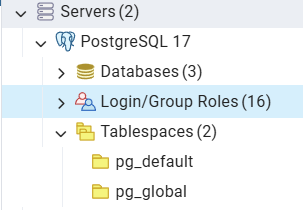

# Instruções de utilização

### Pré-Requisitos para utilizar a API (localmente):
1. **Clone o repositório em sua máquina local usando o comando abaixo ou faça manualmente em sua IDE** 
  ````
  git clone https://github.com/ICEI-PUC-Minas-PMV-ADS/pmv-ads-2025-2-e5-proj-empext-t3-commander150150.git
  ````
2. **Instalar o Python**
- Certifique-se de ter o Python 3.12.4 instalado. Você pode fazer o download em [Python 3.12.4](https://www.python.org/downloads/release/python-3124/)

3. **Instalar as dependências do arquivo** [backend/api/requirements.txt](api/requirements.txt):
  - Navegue até a pasta [backend/api](./api) no terminal e execute o seguinte comando para instalar as dependências listadas em [api/requirements.txt](api/requirements.txt):  
  ````shell
  pip install -r requirements.txt
  ````
4. **Criar o Banco de Dados** [PostgreSQL](https://www.postgresql.org/download/) **(localmente) com o nome** `commander150`
- Assista o vídeo do link, caso tenha dúvidas [Vídeo Youtube](https://www.youtube.com/watch?v=vTfrw10hcrI&ab_channel=Dev.OdairMichael) . 

5. **Configurar o Banco de Dados no Projeto**
 - Só é necessário configurar um arquivo chamado **.env** e incluí-lo no diretório [backend/api/core](./api/core/) com todas as constantes necessárias demonstradas mais abaixo
````
DEBUG=True
SECRET_KEY=DyhrkKiVeG

DB_NAME=commander150
DB_USER=postgres
DB_PASSWORD=password
DB_HOST=localhost

EMAIL_PASSWORD="abcd efgh ijkl mnop"
EMAIL_USER="email@gmail.com"

CORS_ALLOWED_ORIGINS=http://localhost:5173,http://192.168.1.5:8081
ALLOWED_HOSTS=localhost,127.0.0.1,192.168.1.5


  ````
- Lembre-se de alterar os valores das constantes com as configurações que fizer ao criar seu banco de dados.
- A senha, é a senha do usuário criado. Por padrão, o **postgres** é o usuário criado ao instalar o PostgreSQL, então basta trocar o valor da constante pela senha que cadastrou.
- Caso não se lembre da senha ou não tenha cadastrado uma, vá até a aba **Login/Group Roles** e encontre o usuário **postgres**. Clique com o botão direito do mouse em cima dele e depois em **Properties**. Em seguida, vá até a aba **Definition**. Lá, inclua a senha no campo **Password**.
- 

6. **Teste de conexão com o DB**
- Crie um arquivo python com qualquer nome dentro do diretorio [api/core](./api/core/) e rode o código abaixo para testar a conexão.
- Não se esqueça de garantir que existe o arquivo [.env](./api/core/.env) no diretório [backend/api/core](./api/core/) com todas as constantes necessárias.

````python
import environ
import psycopg2

# Inicializa as variáveis de ambiente
env = environ.Env(
    DEBUG=(bool, False),
    SECRET_KEY=(str, 'default-secret-key'),
    DB_NAME=(str, 'commander150'),
    DB_USER=(str, 'postgres'),
    DB_PASSWORD=(str, 'password'),
    DB_HOST=(str, 'localhost'),
    EMAIL_PASSWORD=(str, None),
    EMAIL_USER=(str, None),
    CORS_ALLOWED_ORIGINS=(list, []),
    ALLOWED_HOSTS=(list, []),
)

conn = psycopg2.connect(
    dbname=env('DB_NAME'),  # Nome do seu banco
    user=env('DB_USER'),  # Usuario do seu banco
    password=env('DB_PASSWORD'),  # Senha do Usuario do seu banco
    host=env('DB_HOST'),  # Host (Manter este)
    port="5432"  # Porta (Manter esta)
)
print("Conectado!")

````

7. **Criar as Migrations dos Apps**
 - Navegue até o diretório [backend/api](api/) no terminal e rode o comando:
  ````shell
  python manage.py makemigrations
  ````
8. **Aplicar as Migrations dos Apps**
  - Ainda com o terminal na pasta [backend/api](api/), rode o comando:
  ````shell
  python manage.py migrate
  ````
9. **Rodar o Servidor Local Django**
  - Ainda com o terminal na pasta [backend/api](api/), rode o comando:
  ```` shell
  python manage.py runserver 0.0.0.0:8000
  ````

**_Voilà!!!_**