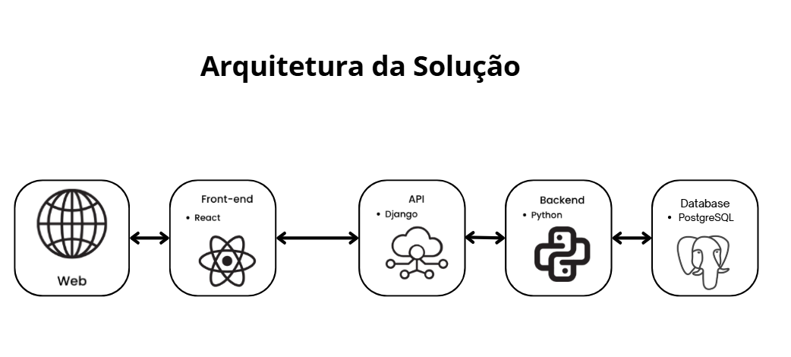

# Especificações do Projeto

Pré-requisitos: <a href="01-Documentação de Contexto.md"> Documentação de Contexto</a>

## Usuários
| Tipo de Usuário   | Descrição | Responsabilidades |
|------------------|-----------|------------------|
| **Loja(Administrador)** | Gerencia a aplicação, os usuários e os torneios | Criar e gerenciar usuários, pontuação e torneios.  |
| **Jogador** |  Usa a aplicação durante os torneios | Se inscrever e desinscrever de torneios, visualizar a pontuação e a organização das mesas.  |

## Arquitetura e Tecnologias

A arquitetura definida para o projeto segue o modelo de aplicação em camadas, garantindo separação de responsabilidades, escalabilidade e facilidade de manutenção.

- **Front-end**: desenvolvido em React.js, responsável pela interface web e pela experiência do usuário. Essa camada consome os serviços disponibilizados pela API, exibindo dados de forma dinâmica e interativa.

- **Back-end**: implementado em Django (Python), responsável pelas regras de negócio, controle de autenticação, autorização e integração com o banco de dados.

- **Banco de Dados**: será utilizado o PostgreSQL, um sistema de gerenciamento de banco de dados relacional robusto e confiável, adequado para lidar com grandes volumes de informação.

- **API-Backend**: a comunicação entre front-end e back-end será realizada por meio de uma API RESTful, permitindo a troca de dados de forma padronizada, segura e escalável.

A imagem abaixo representa visualmente a arquitetura para a aplicação:

## Project Model Canvas

Deve ser desenvolvido a partir do microfundamento: Empreendedorismo e inovação.
Colocar a imagem do modelo construído apresentando a proposta de solução.

> **Links Úteis**:
> Disponíveis em material de apoio do projeto

## Requisitos

As tabelas que se seguem apresentam os requisitos funcionais e não funcionais que detalham o escopo do projeto. Para determinar a prioridade de requisitos, aplicar uma técnica de priorização de requisitos e detalhar como a técnica foi aplicada.

Para mais informações, consulte os microfundamentos Fundamentos de Engenharia de Software e Engenharia de Requisitos de Software. 

### Requisitos Funcionais

|ID    | Descrição do Requisito  | Prioridade |
|------|-----------------------------------------|----|
|RF-001| Criar e gerenciar dados de login | ALTA | 
|RF-002| O usuário deve conseguir recuperar a senha | ALTA |
|RF-003| O sistema deve redirecionar os usuários para a interface correspondente ao seu nível de permissão | ALTA |
|RF-004| O jogador pode se inscrever no começo do torneio | ALTA |
|RF-005| O jogador pode se desinscrever entre as rodadas do torneio | ALTA |
|RF-006| A loja pode inscrever e desinscrever jogadores no começo e entre as rodadas do torneio | ALTA |
|RF-007| O usuário deve visualizar as mesas e o score da rodada | ALTA |
|RF-008| O usuário pode reportar o resultado da partida | ALTA |
|RF-009| O sistema deve gerar, exibir, atualizar e salvar a tabela de score de acordo com os critérios de desempate | ALTA |
|RF-010| A loja pode editar lançamentos de resultado | ALTA |
|RF-011| A loja pode criar e gerenciar torneios | ALTA |
|RF-012| O sistema deve salvar e armazenar dados de partidas | MÉDIA |
|RF-013| A loja pode editar mesas manualmente | MÉDIA |
|RF-014| A loja pode ajustar o sistema de pontuação do torneio | MÉDIA |
|RF-015| O Sistema deve ter um sistema de ranking com filtros | BAIXA |
|RF-016| O usuário pode verificar o histórico de torneio | BAIXA |

### Requisitos não Funcionais

|ID     | Descrição do Requisito                                                                 | Prioridade |
|-------|-----------------------------------------------------------------------------------------|------------|
|RNF-001| O sistema deve ser responsivo para rodar em dispositivos desktop                        | ALTA       |
|RNF-002| O sistema deve respeitar a LGPD (Lei Geral de Proteção de Dados)                        | ALTA       |
|RNF-003| O sistema deve permitir que o usuário aprenda a utilizá-lo de forma intuitiva             | MÉDIA      |
|RNF-004| O sistema deve ser projetado de forma escalável, permitindo a adição de novas funções   | MÉDIA      |
|RNF-005| O sistema deve garantir autenticação e controle de acesso seguro às funcionalidades     | ALTA       |
|RNF-006| O sistema deve ter tempo de resposta máximo de 3 segundos em 95% das requisições        | ALTA       |
|RNF-007| O sistema deve ser compatível com os principais navegadores do mercado (Chrome, Edge, Firefox, Safari) | MÉDIA |
|RNF-008| O sistema deve ser monitorado para identificar e resolver falhas ou problemas de desempenho | ALTA |
|RNF-009| O sistema deve permitir exportação de dados (resultados, partidas e classificações) em formatos CSV e PDF | MÉDIA |
|RNF-010| O sistema deve manter logs de auditoria para ações críticas (inscrição, geração de rodada, lançamento/edição de resultados, ajustes de pontuação) | ALTA |
|RNF-011| A operação de geração de rodadas deve ser atômica, garantindo consistência nos emparelhamentos | ALTA |
|RNF-012| O sistema deve utilizar datas e horários no formato brasileiro (dd/mm/aaaa, 24h, fuso horário America/São_Paulo) | MÉDIA |
|RNF-013| O sistema deve garantir armazenamento seguro e backup periódico dos dados de torneios e partidas | ALTA |
|RNF-014| O sistema deve fornecer relatórios e telas de impressão amigáveis para Scores e Rodadas  | MÉDIA      |
|RNF-015| O sistema deve possuir mecanismos de auditoria e rastreabilidade para ajustes manuais em mesas e pontuações | ALTA |

## Restrições

O projeto está restrito pelos itens apresentados na tabela a seguir.

|ID | Restrição                                                                 |
|---|---------------------------------------------------------------------------|
|01 | O projeto deverá ser entregue até o final do semestre 2025-2              |
|02 | Não pode ser desenvolvido um módulo de backend                            |
|03 | O sistema deve ser desenvolvido majoritariamente utilizando tecnologias open-source devido ao limitado orçamento |
|04 | O orçamento disponível para o projeto é limitado                          |

## Diagrama de Caso de Uso

O diagrama de casos de uso é o próximo passo após a elicitação de requisitos, que utiliza um modelo gráfico e uma tabela com as descrições sucintas dos casos de uso e dos atores. Ele contempla a fronteira do sistema e o detalhamento dos requisitos funcionais com a indicação dos atores, casos de uso e seus relacionamentos. 

Para mais informações, consulte o microfundamento Engenharia de Requisitos de Software 

As referências abaixo irão auxiliá-lo na geração do artefato “Diagrama de Casos de Uso”.

> **Links Úteis**:
> - [Criando Casos de Uso](https://www.ibm.com/docs/pt-br/elm/6.0?topic=requirements-creating-use-cases)
> - [Como Criar Diagrama de Caso de Uso: Tutorial Passo a Passo](https://gitmind.com/pt/fazer-diagrama-de-caso-uso.html/)
> - [Lucidchart](https://www.lucidchart.com/)
> - [Astah](https://astah.net/)
> - [Diagrams](https://app.diagrams.net/)

## Modelo da Base de Dados

- ### MER (Modelo Entidade-Relacionamento)
O MER representa através de um diagrama como as entidades (coisas, objetos) se relacionam entre si na aplicação interativa.
> 

- ### Modelo Físico
Scripts de criação das tabelas do banco de dados incluído dentro da pasta documentos/img/pucare_database.sql.
> [Modelo físico do banco de dados](../documentos/img/pucare_database.sql)

