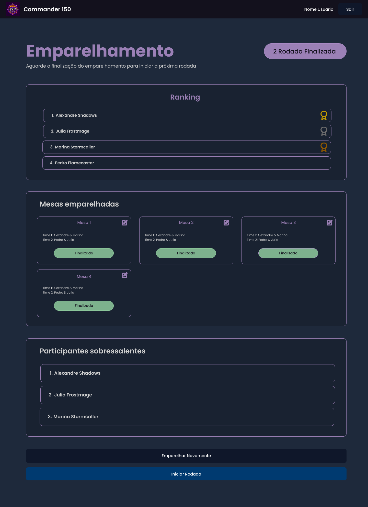

# Projeto de Interface

Pré-requisitos: <a href="02-Especificação do Projeto.md"> Especificação do Projeto</a>

Visão geral da interação do usuário com as funcionalidades que fazem parte do sistema sociotécnico (protótipo de telas).

## Wireframes

&emsp;Wireframes são representações visuais que delineiam a estrutura de uma interface em aplicações, destacando os elementos que compõem a tela e suas inter-relações. Esses protótipos permitem visualizar a organização e disposição dos componentes da interface, promovendo um design mais intuitivo e funcional. Enquanto o diagrama de fluxo apresentado na seção anterior descreve o percurso teórico do usuário, os wireframes a seguir oferecem uma materialização visual mais detalhada desse trajeto.

Telas: <a href="https://www.figma.com/design/yAVkthQl5FRM1UMND0kPZl/Untitled?t=8qAuALt9BCVI4ulF-1"> Telas no figma</a>

### Jogador
_Telas_

 
 

 
 

 
 

 
 

 
 

 
 

 
 

 
 

 
 

 
 

 
 

 
 

 
 

 
 

 
 

 
 

 
 

 
 

 
 

 
 

 
 
