# Planos de Testes de Software
Este documento apresenta os casos de teste de **Sucesso** e **Insucesso** para a verificação e validação da aplicação.

### Tipo de Teste
- **Sucesso**: Tem o objetivo de verificar se as funcionalidades funcionam corretamente.
- **Insucesso**: Tem o objetivo de verificar se o sistema trata erros de maneira correta.

### ETAPA 2  

| Módulo        | Operação             | ID       | Cenário                               | Entrada                                             | Status Esperado | Assertivas |
|---------------|----------------------|----------|---------------------------------------|-----------------------------------------------------|-----------------|------------|
| Autenticação  | Realizar Login       | CT-001-S | Credenciais válidas                   | Email válido, senha válida                          | Sucesso         | Cria uma sessão e retorna os dados do usuário |
| Autenticação  | Realizar Login       | CT-001-I | Credenciais inválidas                 | Email válido, senha inválida                        | Insucesso       | Retorna código e mensagem de erro |
| Autenticação  | Recuperar senha      | CT-002-S | Recuperação com email válido          | Email cadastrado                                    | Sucesso         | Token enviado para email |
| Autenticação  | Recuperar senha      | CT-002-I | Recuperação com email inválido        | Email não cadastrado                                | Insucesso       | Retorna código e mensagem de erro |
| Permissão     | Controlar Acesso     | CT-003-S | Acesso aos próprios dados             | SessionID atrelado ao dono dos dados                | Sucesso         | Retorna os dados requisitados |
| Permissão     | Controlar Acesso     | CT-003-I | Acesso a dados que pertencem a outro usuário                    | SessionID não atrelado ao dono dos dados                                  | Insucesso       | Retorna código e mensagem de erro |
| Torneio       | Inscrição            | CT-004-S | Jogador se inscreve                   | Dados válidos, torneio aberto                       | Sucesso         | Jogador inscrito |
| Torneio       | Inscrição            | CT-004-I | Inscrição fora do prazo               | Jogador válido, torneio encerrado                   | Insucesso       | Mensagem "Inscrição indisponível" |
| Torneio       | Desinscrição         | CT-005-S | Jogador se desinscreve                | Jogador inscrito, rodada entre turnos               | Sucesso         | Jogador removido |
| Torneio       | Desinscrição         | CT-005-I | Desinscrição fora do prazo            | Jogador inscrito, rodada em andamento               | Insucesso       | Mensagem "Desinscrição indisponível" |
| Loja          | Inscrição jogador    | CT-006-S | Inscrição pela loja                   | Jogador válido, torneio aberto                      | Sucesso         | Jogador inscrito pela loja |
| Loja          | Desinscrição jogador | CT-006-I | Desinscrição após término             | Jogador válido, torneio encerrado                   | Insucesso       | Mensagem de erro |
| Rodada        | Visualizar score     | CT-007-S | Visualização de mesas e score         | Rodada ativa                                        | Sucesso         | Exibe mesas e pontuação |
| Rodada        | Visualizar score     | CT-007-I | Erro ao carregar mesas                | Rodada inexistente                                  | Insucesso       | Mensagem "Dados indisponíveis" |
| Partida       | Reportar resultado   | CT-008-S | Reporte válido                        | Partida ativa, resultado válido                     | Sucesso         | Resultado registrado |
| Partida       | Reportar resultado   | CT-008-I | Reporte inválido                      | Resultado fora do padrão                            | Insucesso       | Mensagem de erro |
| Score         | Gerar tabela         | CT-009-S | Geração automática                    | Partidas válidas                                    | Sucesso         | Tabela de score atualizada |
| Score         | Gerar tabela         | CT-009-I | Falha ao atualizar tabela             | Dados corrompidos                                   | Insucesso       | Mensagem de falha |
| Loja          | Editar resultado     | CT-010-S | Edição válida                         | Resultado válido                                    | Sucesso         | Alteração salva |
| Loja          | Editar resultado     | CT-010-I | Edição inválida                       | Resultado incorreto                                 | Insucesso       | Mensagem de erro |
| Loja          | Gerenciar torneios   | CT-011-S | Criação válida de torneio             | Dados válidos                                       | Sucesso         | Torneio criado |
| Loja          | Gerenciar torneios   | CT-011-I | Criação inválida de torneio           | Nome vazio                                          | Insucesso       | Sistema rejeita criação |
| Partida       | Salvar dados         | CT-012-S | Salvamento automático                 | Partida válida                                      | Sucesso         | Dados salvos |
| Partida       | Salvar dados         | CT-012-I | Falha no salvamento                   | Erro de rede                                        | Insucesso       | Mensagem de falha |
| Mesas         | Editar manualmente   | CT-013-S | Edição válida                         | Mesa válida                                         | Sucesso         | Alteração salva |
| Mesas         | Editar manualmente   | CT-013-I | Edição inválida                       | Número de mesa inexistente                          | Insucesso       | Mensagem de erro |
| Pontuação     | Ajustar sistema      | CT-014-S | Ajuste válido                         | Critérios válidos                                   | Sucesso         | Sistema aplica novas regras |
| Pontuação     | Ajustar sistema      | CT-014-I | Ajuste inválido                       | Critérios fora do padrão                            | Insucesso       | Mensagem de erro |
| Autenticação  | Recuperar senha      | CT-015-S | Recuperação com token válido          | Token válido                                        | Sucesso         | Nova senha enviada para email |
| Autenticação  | Recuperar senha      | CT-015-I | Recuperação com token inválido        | Token inválido                                      | Insucesso       | Retorna código e mensagem de erro |
| Autenticação  | Alterar senha        | CT-016-S | Alteração de senha com senha atual válida          | Senha atual válida                     | Sucesso         | Altera a senha |
| Autenticação  | Alterar senha        | CT-016-I | Alteração de senha com senha atual inválida        | Senha atual inválida                                | Insucesso       | Retorna código e mensagem de erro |
| Autenticação  | Alterar senha        | CT-017-I | Alteração de senha com nova senha igual a senha atual        | Nova senha igual a senha atual                                | Insucesso       | Retorna código e mensagem de erro |
| Permissão     | Controlar Acesso     | CT-018-S | Acesso a dados que pertencem a outro usuário sendo Admin             | ID de usuário com tipo ADMIN           | Sucesso         | Retorna os dados requisitados |
| Autenticação  | Cadastro             | CT-019-S | Cadastro com email e usuário válidos  | Email e username válidos                            | Sucesso         | Cadastra o usuário no sistema |
| Autenticação  | Cadastro             | CT-019-I | Cadastro com email e/ou usuário inválidos       | Email e/ou username inválidos                                      | Insucesso       | Retorna código e mensagem de erro |
| Rodada  | Detalhes rodada      | CT-020-S | Capturar detalhes da rodada        | ID rodada existente                                      | Sucesso       | Retorna detalhes da rodada |
| Rodada  | Detalhes rodada      | CT-020-I | Procurar rodada inexistente        | ID rodada inexistente                                      | Insucesso       | Retorna 404 e mensagem de erro |
| Mesas  | Mesas da rodada      | CT-021-S | Detalhar todas as mesas de uma rodada        | ID rodada existente                                      | Sucesso       | Retorna mesas e jogadores na mesa |
| Mesas  | Mesas da rodada      | CT-021-I | Procurar mesas de rodada inexistente        | ID rodada inexistente                                    | Insucesso       | Retorna 404 e mensagem de erro |
| Mesas  | Detalhe mesa    | CT-022-S | Detalha a mesa e os jogadores      | ID mesa existente                                      | Sucesso       | Retorna detalhes da mesa e dos jogadores na mesa |
| Mesas  | Detalhe mesa    | CT-022-I | Procurar mesa inexistente      | ID mesa inexistente                                    | Insucesso       | Retorna 404 e mensagem de erro |
| Torneio  | Detalhes torneio      | CT-023-S | Capturar detalhes de um torneio        | ID torneio existente                                      | Sucesso       | Retorna detalhes do torneio |
| Torneio  | Detalhes torneio      | CT-023-I | Procurar torneio inexistente        | ID torneio inexistente                                      | Insucesso       | Retorna 404 e mensagem de erro |

### ETAPA 3
Criar casos de teste da etapa 3

### ETAPA 4
Criar casos de teste da etapa 4
 
# Evidências de Testes de Software

Apresentação de imagens e/ou vídeos que comprovam que um determinado teste foi executado, e o resultado esperado foi obtido.

## Parte 1 - Testes de desenvolvimento
Cada funcionalidade desenvolvida deve ser testada pelo próprio desenvolvedor, utilizando casos de teste, tanto de sucesso quanto de insucesso, elaborados por ele. Todos os testes devem ser evidenciados.

### ETAPA 2

<!-- Teste Gaby -->
<table>
  <tr>
    <th colspan="6" width="1000">CT-011-S - A loja pode criar e gerenciar torneios</th>
  </tr>
  <tr>
    <td width="170"><strong>Critérios de êxito</strong></td>
    <td colspan="5">A loja deve conseguir criar o torneio</td>
  </tr>
    <tr>
    <td><strong>Responsável pela funcionalidade (desenvolvimento e teste)</strong></td>
    <td width="430">Gabriela Franklin Sá de Moura </td>
     <td width="100"><strong>Data do Teste</strong></td>
    <td width="150">17/09/2025</td>
  </tr>
    <tr>
    <td width="170"><strong>Comentário</strong></td>
    <td colspan="5">O teste foi realizado no Swagger, onde é possível ver que a inscrição do torneio feita por um usuário loja foi um sucesso(200). As evidências estão na ordem da requisição</td>
  </tr>
  <tr>
    <td colspan="6" align="center"><strong>Evidência</strong></td>
  </tr>
  <tr>
    <td colspan="6" align="center">Imagem 1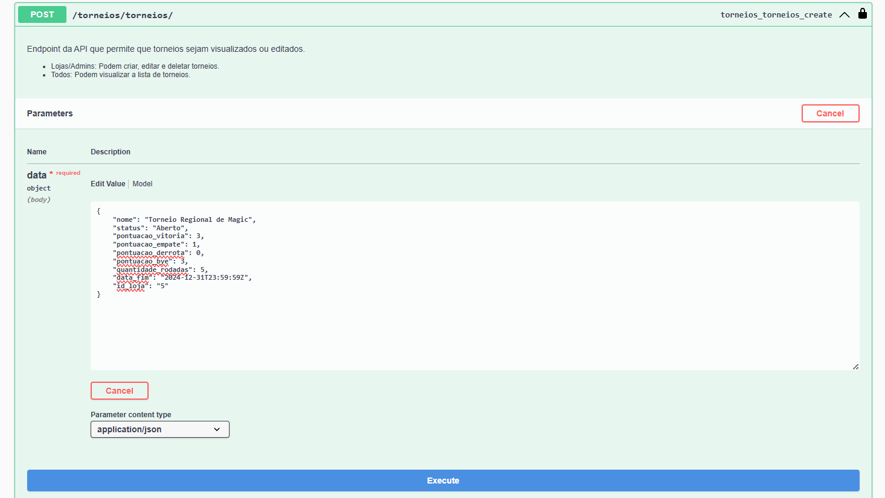</td>
  </tr>
  <tr> 
   <td colspan="6" align="center">Imagem 2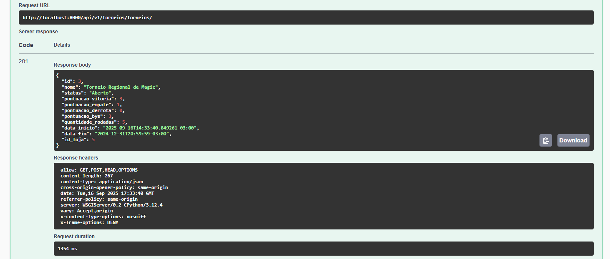</td>   
  </tr>
</table>

<table>
  <tr>
    <th colspan="6" width="1000">CT-011-I - A loja pode criar e gerenciar torneios</th>
  </tr>
  <tr>
    <td width="170"><strong>Critérios de êxito</strong></td>
    <td colspan="5">A loja não deve conseguir criar o torneio</td>
  </tr>
    <tr>
    <td><strong>Responsável pela funcionalidade (desenvolvimento e teste)</strong></td>
    <td width="430">Gabriela Franklin Sá de Moura </td>
     <td width="100"><strong>Data do Teste</strong></td>
    <td width="150">17/09/2025</td>
  </tr>
    <tr>
    <td width="170"><strong>Comentário</strong></td>
    <td colspan="5">O teste foi realizado no Swagger, onde é possível ver que a inscrição do torneio não conseguiu ser efetuada(400), pois não foi informado o nome do torneio. As evidências estão na ordem da requisição</td>
  </tr>
  <tr>
    <td colspan="6" align="center"><strong>Evidência</strong></td>
  </tr>
  <tr>
    <td colspan="6" align="center">Imagem 1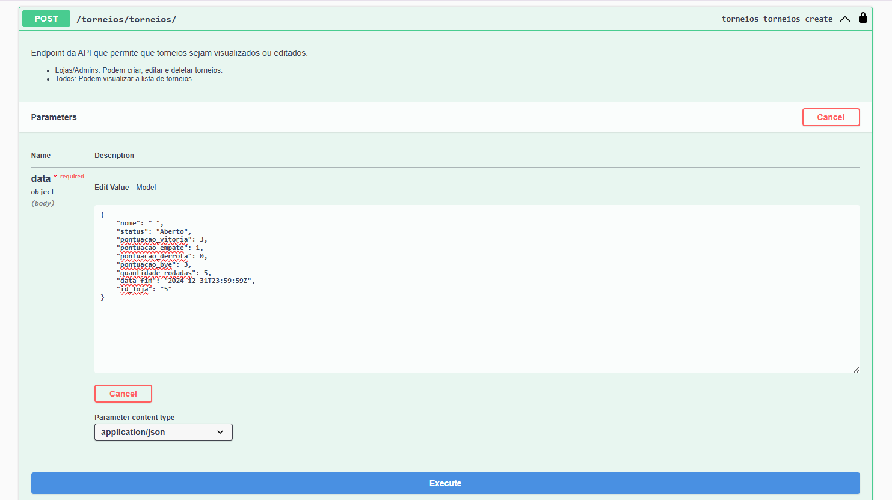</td>
  </tr>
  <tr> 
   <td colspan="6" align="center">Imagem 2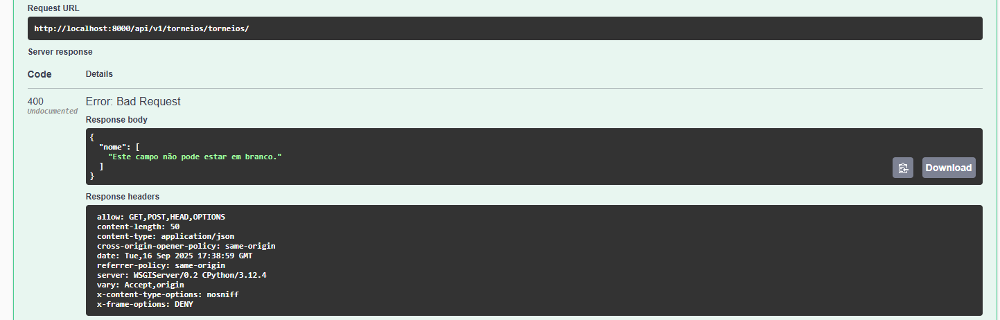</td>   
  </tr>
</table>

<table>
  <tr>
    <th colspan="6" width="1000">CT-014-S - A loja pode ajustar o sistema de pontuação do torneio</th>
  </tr>
  <tr>
    <td width="170"><strong>Critérios de êxito</strong></td>
    <td colspan="5">A loja deve conseguir ajustar a pontuação de uma mesa em uma rodada específica do torneio</td>
  </tr>
    <tr>
    <td><strong>Responsável pela funcionalidade (desenvolvimento e teste)</strong></td>
    <td width="430">Gabriela Franklin Sá de Moura </td>
     <td width="100"><strong>Data do Teste</strong></td>
    <td width="150">17/09/2025</td>
  </tr>
    <tr>
    <td width="170"><strong>Comentário</strong></td>
    <td colspan="5">O teste foi realizado no Swagger, onde é possível ver que a alteração da pontuação dos times feita por um usuário loja foi um sucesso(200). As evidências estão na ordem da requisição, sendo que a primeira evidencia mostra como estavam os resultados originais no banco de dados.</td>
  </tr>
  <tr>
    <td colspan="6" align="center"><strong>Evidência</strong></td>
  </tr>
  <tr>
    <td colspan="6" align="center">Imagem 1 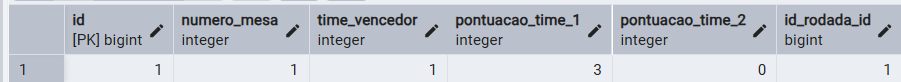</td>
  </tr>
  <tr> 
   <td colspan="6" align="center">Imagem 2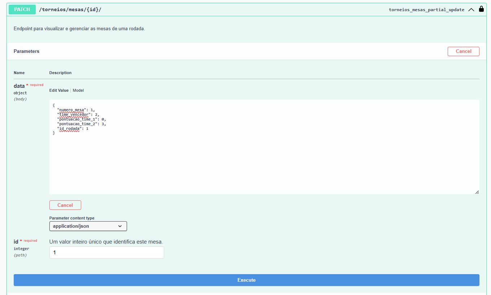</td>   
  </tr>
   <tr> 
   <td colspan="6" align="center">Imagem 3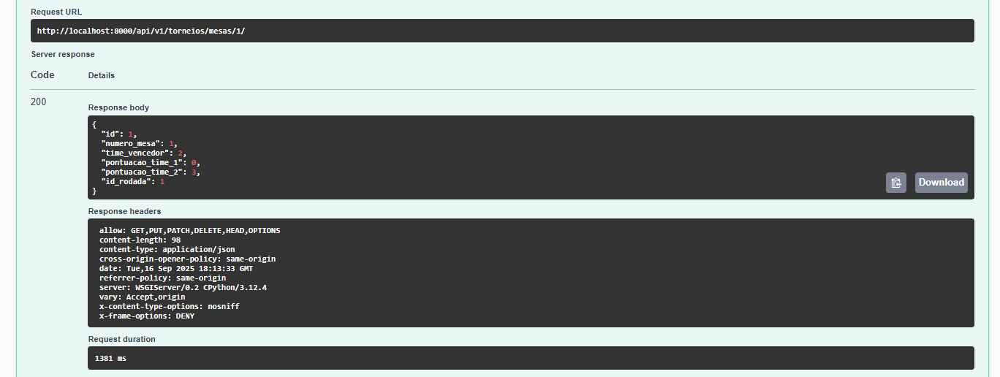</td>   
  </tr>
</table>

<table>
  <tr>
    <th colspan="6" width="1000">CT-014-I - A loja pode ajustar o sistema de pontuação do torneio</th>
  </tr>
  <tr>
    <td width="170"><strong>Critérios de êxito</strong></td>
    <td colspan="5">A loja  não deve conseguir ajustar a pontuação de uma mesa em uma rodada específica do torneio</td>
  </tr>
    <tr>
    <td><strong>Responsável pela funcionalidade (desenvolvimento e teste)</strong></td>
    <td width="430">Gabriela Franklin Sá de Moura </td>
     <td width="100"><strong>Data do Teste</strong></td>
    <td width="150">17/09/2025</td>
  </tr>
    <tr>
    <td width="170"><strong>Comentário</strong></td>
    <td colspan="5">O teste foi realizado no Swagger, onde é possível ver que a alteração da pontuação dos times feita por um usuário loja nâo foi efetuada(400), devido a alteração na pontuação, o que não foi permitido naquela mesa.</td>
  </tr>
  <tr>
    <td colspan="6" align="center"><strong>Evidência</strong></td>
  </tr>
  <tr>
    <td colspan="6" align="center">Imagem 1 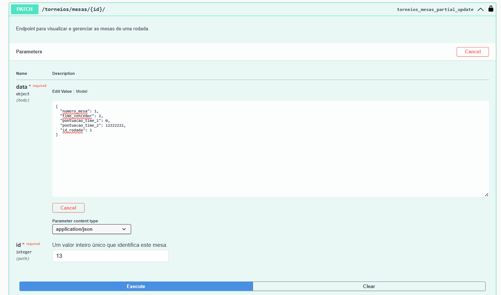</td>
  </tr>
  <tr> 
   <td colspan="6" align="center">Imagem 2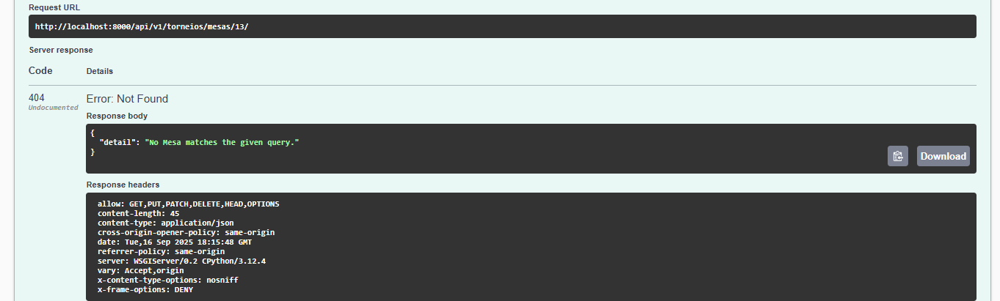</td>   
  </tr>
</table>

<!-- Testes Lucas -->
<table>
  <tr>
    <th colspan="6" width="1000">CT-001-S  Autenticação com credenciais válidas</th>
  </tr>
  <tr>
    <td width="170"><strong>Critérios de êxito</strong></td>
    <td colspan="5">O usuário deve conseguir se autenticar na aplicação, recebendo um código 200, a sessionID e seus dados no retorno da requisição.</td>
  </tr>
    <tr>
    <td><strong>Responsável pela funcionalidade (desenvolvimento e teste)</strong></td>
    <td width="430">Lucas Campos de Abreu </td>
     <td width="100"><strong>Data do Teste</strong></td>
    <td width="150">18/09/2025</td>
  </tr>
    <tr>
    <td width="170"><strong>Comentário</strong></td>
    <td colspan="5">A API retornou o código 200, dados do usuário que foi autenticado e criou um sessionID com sucesso.</td>
  </tr>
  <tr>
    <td colspan="6" align="center"><strong>Evidência</strong></td>
  </tr>
  <tr>
    <td colspan="6" align="center"> 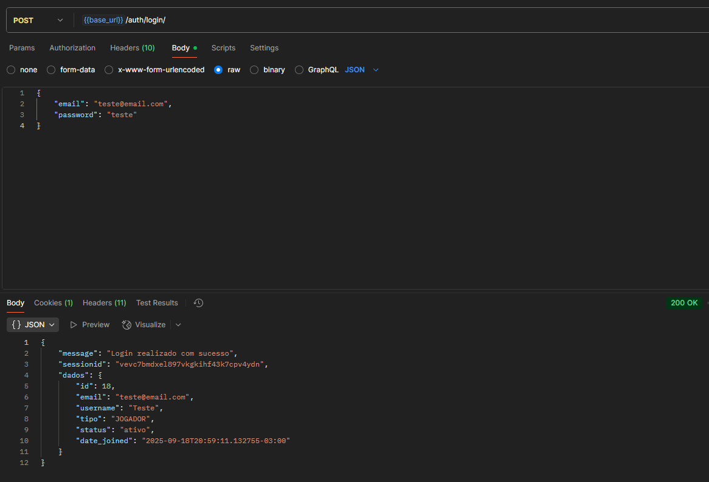</td>
  </tr>
</table>

<table>
  <tr>
    <th colspan="6" width="1000">CT-001-I  Autenticação com credenciais inválidas</th>
  </tr>
  <tr>
    <td width="170"><strong>Critérios de êxito</strong></td>
    <td colspan="5">O usuário não deve conseguir se autenticar na aplicação, recebendo um código 401 e uma mensagem de erro.</td>
  </tr>
    <tr>
    <td><strong>Responsável pela funcionalidade (desenvolvimento e teste)</strong></td>
    <td width="430">Lucas Campos de Abreu </td>
     <td width="100"><strong>Data do Teste</strong></td>
    <td width="150">18/09/2025</td>
  </tr>
    <tr>
    <td width="170"><strong>Comentário</strong></td>
    <td colspan="5">A API retornou o código 401 e uma mensagem de erro.</td>
  </tr>
  <tr>
    <td colspan="6" align="center"><strong>Evidência</strong></td>
  </tr>
  <tr>
    <td colspan="6" align="center"> 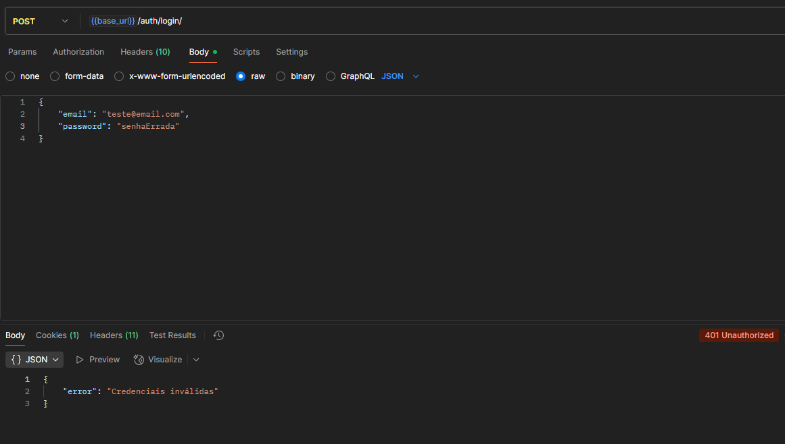</td>
  </tr>
</table>

<table>
  <tr>
    <th colspan="6" width="1000">CT-002-S  Recuperação de senha com email válido</th>
  </tr>
  <tr>
    <td width="170"><strong>Critérios de êxito</strong></td>
    <td colspan="5">O usuário deve receber um token de validação em seu email.</td>
  </tr>
    <tr>
    <td><strong>Responsável pela funcionalidade (desenvolvimento e teste)</strong></td>
    <td width="430">Lucas Campos de Abreu </td>
     <td width="100"><strong>Data do Teste</strong></td>
    <td width="150">18/09/2025</td>
  </tr>
    <tr>
    <td width="170"><strong>Comentário</strong></td>
    <td colspan="5">O usuário recebeu seu token de validação por email, além de um código 200 e uma mensagem de êxito na response da API.</td>
  </tr>
  <tr>
    <td colspan="6" align="center"><strong>Evidência</strong></td>
  </tr>
  <tr>
    <td colspan="6" align="center"> 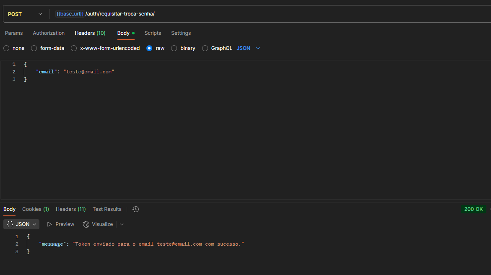</td>
  </tr>
  <tr>
    <td colspan="6" align="center"> 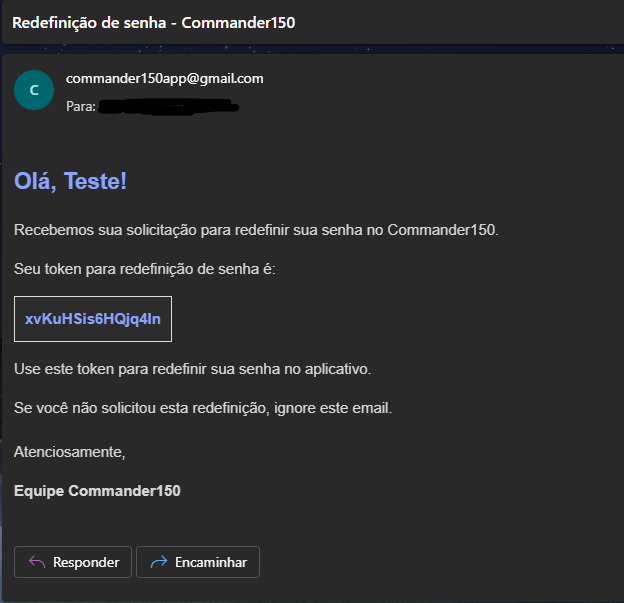</td>
  </tr>
</table>

<table>
  <tr>
    <th colspan="6" width="1000">CT-002-I  Recuperação de senha com email inválido</th>
  </tr>
  <tr>
    <td width="170"><strong>Critérios de êxito</strong></td>
    <td colspan="5">O usuário não deve receber o token por email, recebendo um código 400 e uma mensagem de erro.</td>
  </tr>
    <tr>
    <td><strong>Responsável pela funcionalidade (desenvolvimento e teste)</strong></td>
    <td width="430">Lucas Campos de Abreu </td>
     <td width="100"><strong>Data do Teste</strong></td>
    <td width="150">18/09/2025</td>
  </tr>
    <tr>
    <td width="170"><strong>Comentário</strong></td>
    <td colspan="5">A API retornou o código 400 e uma mensagem de erro.</td>
  </tr>
  <tr>
    <td colspan="6" align="center"><strong>Evidência</strong></td>
  </tr>
  <tr>
    <td colspan="6" align="center"> 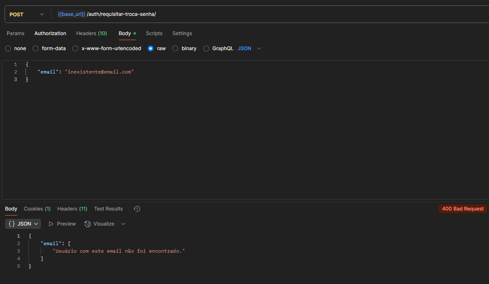</td>
  </tr>
</table>

<table>
  <tr>
    <th colspan="6" width="1000">CT-003-S  Acesso aos própios dados</th>
  </tr>
  <tr>
    <td width="170"><strong>Critérios de êxito</strong></td>
    <td colspan="5">O usuário deve receber os dados requisitados.</td>
  </tr>
    <tr>
    <td><strong>Responsável pela funcionalidade (desenvolvimento e teste)</strong></td>
    <td width="430">Lucas Campos de Abreu </td>
     <td width="100"><strong>Data do Teste</strong></td>
    <td width="150">18/09/2025</td>
  </tr>
    <tr>
    <td width="170"><strong>Comentário</strong></td>
    <td colspan="5">O usuário recebeu os dados requisitados, além de um código 200 e uma mensagem de êxito na response da API, visto que o sessionID enviado na requisição está atrelado ao dono dos dados requisitados.</td>
  </tr>
  <tr>
    <td colspan="6" align="center"><strong>Evidência</strong></td>
  </tr>
  <tr>
    <td colspan="6" align="center"> 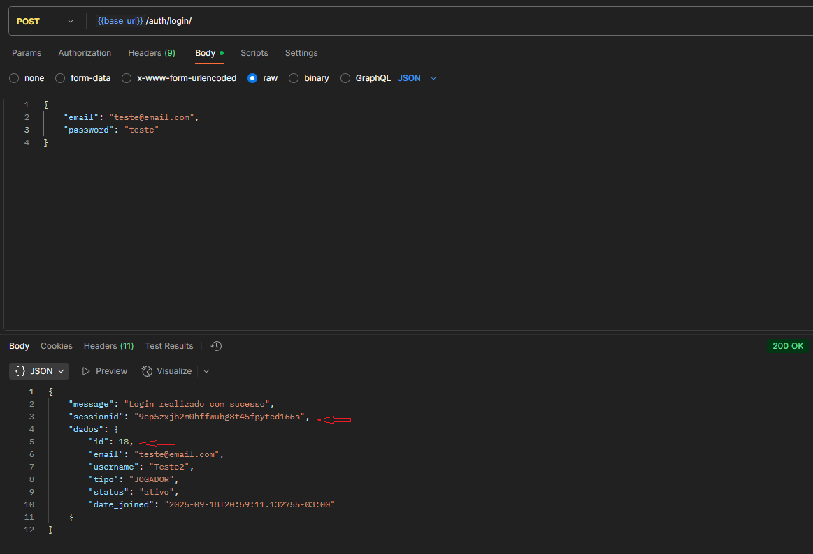</td>
  </tr>
   <tr>
    <td colspan="6" align="center"> 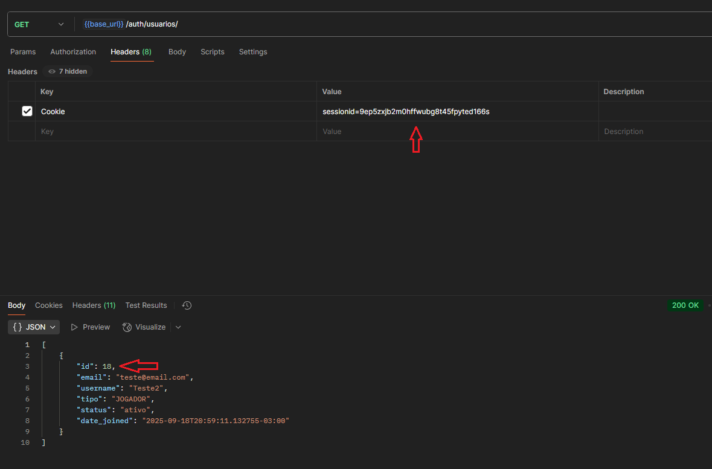</td>
  </tr>
</table>

<table>
  <tr>
    <th colspan="6" width="1000">CT-003-I  Acesso aos dados de outro usuário</th>
  </tr>
  <tr>
    <td width="170"><strong>Critérios de êxito</strong></td>
    <td colspan="5">O usuário não deve receber os dados requisitados.</td>
  </tr>
    <tr>
    <td><strong>Responsável pela funcionalidade (desenvolvimento e teste)</strong></td>
    <td width="430">Lucas Campos de Abreu </td>
     <td width="100"><strong>Data do Teste</strong></td>
    <td width="150">18/09/2025</td>
  </tr>
    <tr>
    <td width="170"><strong>Comentário</strong></td>
    <td colspan="5">A API retornou o código 403 e uma mensagem de erro.</td>
  </tr>
  <tr>
    <td colspan="6" align="center"><strong>Evidência</strong></td>
  </tr>
  <tr>
    <td colspan="6" align="center"> </td>
  </tr>
  <tr>
    <td colspan="6" align="center"> 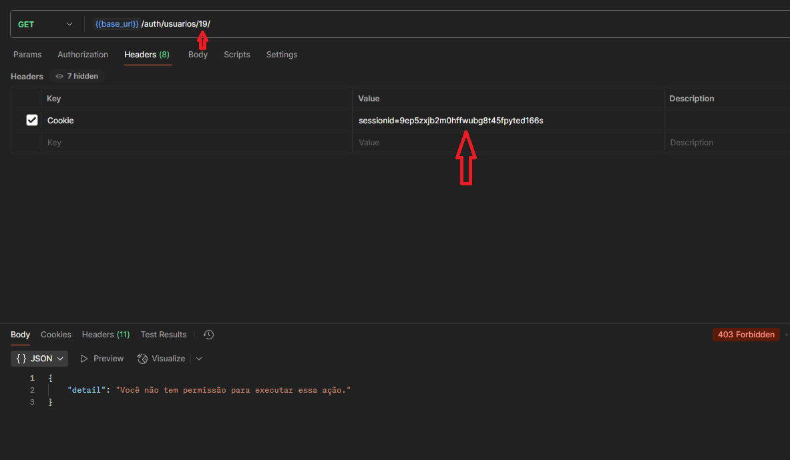</td>
  </tr>
</table>

<table>
  <tr>
    <th colspan="6" width="1000">CT-015-S  Recuperação de senha com token válido</th>
  </tr>
  <tr>
    <td width="170"><strong>Critérios de êxito</strong></td>
    <td colspan="5">O usuário deve receber a nova senha em seu email.</td>
  </tr>
    <tr>
    <td><strong>Responsável pela funcionalidade (desenvolvimento e teste)</strong></td>
    <td width="430">Lucas Campos de Abreu </td>
     <td width="100"><strong>Data do Teste</strong></td>
    <td width="150">18/09/2025</td>
  </tr>
    <tr>
    <td width="170"><strong>Comentário</strong></td>
    <td colspan="5">O usuário recebeu sua nova senha por email, além de um código 200 e uma mensagem de êxito na response da API.</td>
  </tr>
  <tr>
    <td colspan="6" align="center"><strong>Evidência</strong></td>
  </tr>
  <tr>
    <td colspan="6" align="center"> 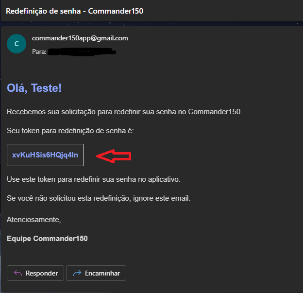</td>
  </tr>
  <tr>
    <td colspan="6" align="center"> 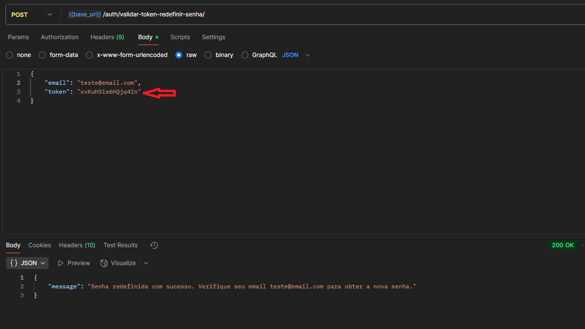</td>
  </tr>
   <tr>
    <td colspan="6" align="center"> 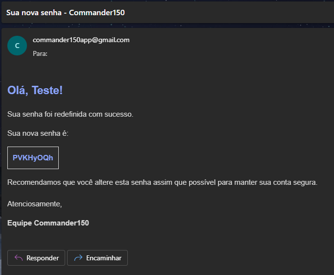</td>
  </tr>
  <tr>
    <td colspan="6" align="center"> 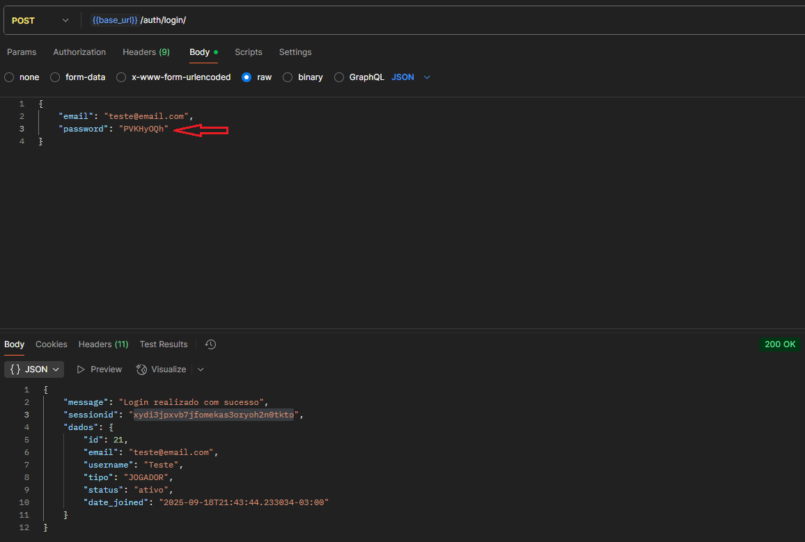</td>
  </tr>
</table>

<table>
  <tr>
    <th colspan="6" width="1000">CT-015-I  Recuperação de senha com token inválido</th>
  </tr>
  <tr>
    <td width="170"><strong>Critérios de êxito</strong></td>
    <td colspan="5">O usuário não deve receber a nova senha em seu email.</td>
  </tr>
    <tr>
    <td><strong>Responsável pela funcionalidade (desenvolvimento e teste)</strong></td>
    <td width="430">Lucas Campos de Abreu </td>
     <td width="100"><strong>Data do Teste</strong></td>
    <td width="150">18/09/2025</td>
  </tr>
    <tr>
    <td width="170"><strong>Comentário</strong></td>
    <td colspan="5">A API retornou o código 400 e uma mensagem de erro.</td>
  </tr>
  <tr>
    <td colspan="6" align="center"><strong>Evidência</strong></td>
  </tr>
  <tr>
    <td colspan="6" align="center"> 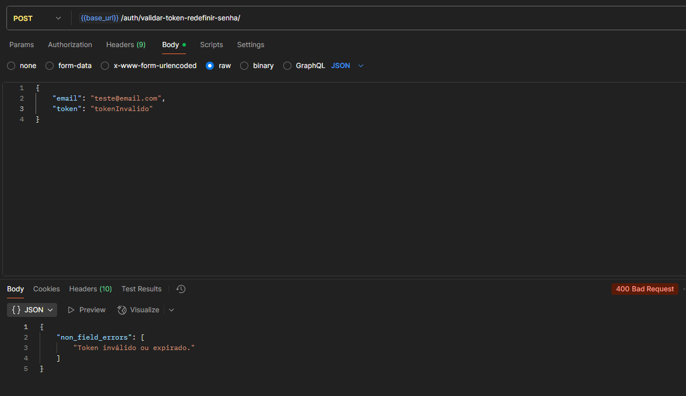</td>
  </tr>
</table>

<table>
  <tr>
    <th colspan="6" width="1000">CT-016-S  Alteração de senha com senha atual válida</th>
  </tr>
  <tr>
    <td width="170"><strong>Critérios de êxito</strong></td>
    <td colspan="5">O usuário deve conseguir alterar sua senha.</td>
  </tr>
    <tr>
    <td><strong>Responsável pela funcionalidade (desenvolvimento e teste)</strong></td>
    <td width="430">Lucas Campos de Abreu </td>
     <td width="100"><strong>Data do Teste</strong></td>
    <td width="150">18/09/2025</td>
  </tr>
    <tr>
    <td width="170"><strong>Comentário</strong></td>
    <td colspan="5">O usuário conseguiu realizar a alteração da senha, além de um código 200 e uma mensagem de êxito na response da API.</td>
  </tr>
  <tr>
    <td colspan="6" align="center"><strong>Evidência</strong></td>
  </tr>
  <tr>
    <td colspan="6" align="center"> 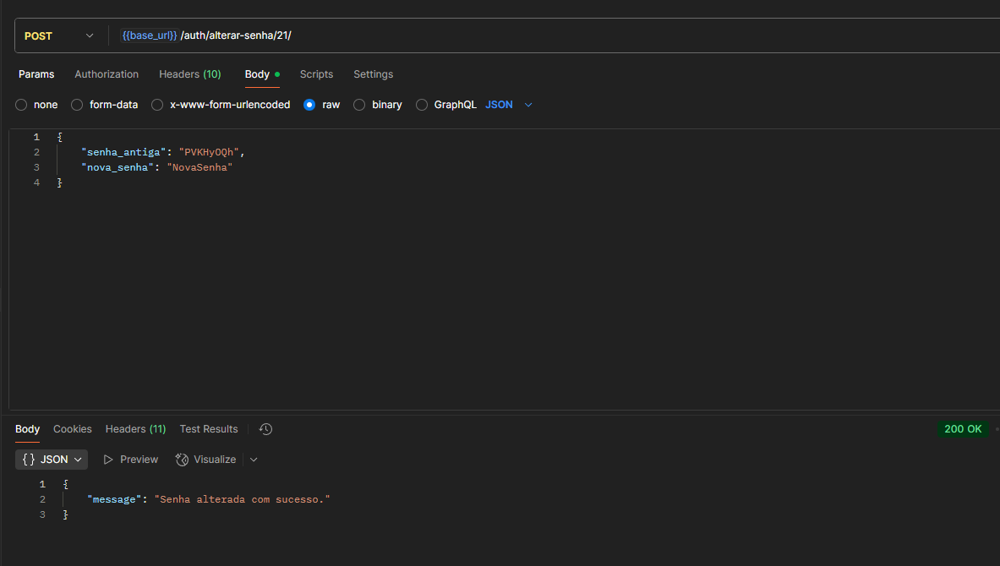</td>
  </tr>
</table>

<table>
  <tr>
    <th colspan="6" width="1000">CT-016-I  Alteração de senha com senha atual inválida</th>
  </tr>
  <tr>
    <td width="170"><strong>Critérios de êxito</strong></td>
    <td colspan="5">O usuário não deve conseguir alterar sua senha.</td>
  </tr>
    <tr>
    <td><strong>Responsável pela funcionalidade (desenvolvimento e teste)</strong></td>
    <td width="430">Lucas Campos de Abreu </td>
     <td width="100"><strong>Data do Teste</strong></td>
    <td width="150">18/09/2025</td>
  </tr>
    <tr>
    <td width="170"><strong>Comentário</strong></td>
    <td colspan="5">A API retornou o código 400 e uma mensagem de erro.</td>
  </tr>
  <tr>
    <td colspan="6" align="center"><strong>Evidência</strong></td>
  </tr>
  <tr>
    <td colspan="6" align="center"> 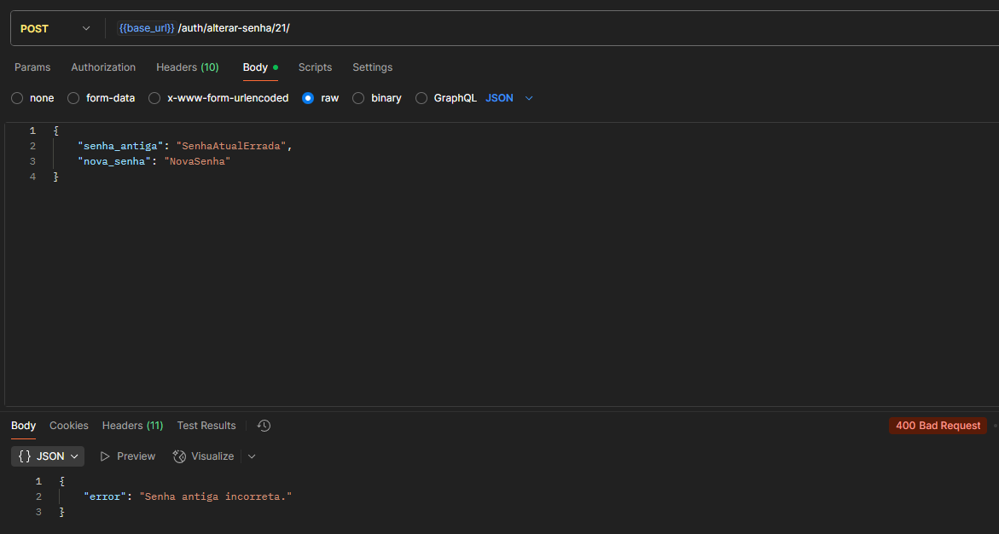</td>
  </tr>
</table>

<table>
  <tr>
    <th colspan="6" width="1000">CT-017-I  Alteração de senha com nova senha igual a senha atual</th>
  </tr>
  <tr>
    <td width="170"><strong>Critérios de êxito</strong></td>
    <td colspan="5">O usuário não deve conseguir alterar sua senha.</td>
  </tr>
    <tr>
    <td><strong>Responsável pela funcionalidade (desenvolvimento e teste)</strong></td>
    <td width="430">Lucas Campos de Abreu </td>
     <td width="100"><strong>Data do Teste</strong></td>
    <td width="150">18/09/2025</td>
  </tr>
    <tr>
    <td width="170"><strong>Comentário</strong></td>
    <td colspan="5">A API retornou o código 400 e uma mensagem de erro.</td>
  </tr>
  <tr>
    <td colspan="6" align="center"><strong>Evidência</strong></td>
  </tr>
  <tr>
    <td colspan="6" align="center"> </td>
  </tr>
</table>

<table>
  <tr>
    <th colspan="6" width="1000">CT-018-S  Acesso aos dados de outro usuário sendo administrador do sistema (ADMIN)</th>
  </tr>
  <tr>
    <td width="170"><strong>Critérios de êxito</strong></td>
    <td colspan="5">O usuário deve receber os dados requisitados.</td>
  </tr>
    <tr>
    <td><strong>Responsável pela funcionalidade (desenvolvimento e teste)</strong></td>
    <td width="430">Lucas Campos de Abreu </td>
     <td width="100"><strong>Data do Teste</strong></td>
    <td width="150">18/09/2025</td>
  </tr>
    <tr>
    <td width="170"><strong>Comentário</strong></td>
    <td colspan="5">O usuário recebeu os dados requisitados, além de um código 200 e uma mensagem de êxito na response da API, visto que o sessionID enviado na requisição está atrelado a um usuário do tipo ADMIN.</td>
  </tr>
  <tr>
    <td colspan="6" align="center"><strong>Evidência</strong></td>
  </tr>
  <tr>
    <td colspan="6" align="center"> 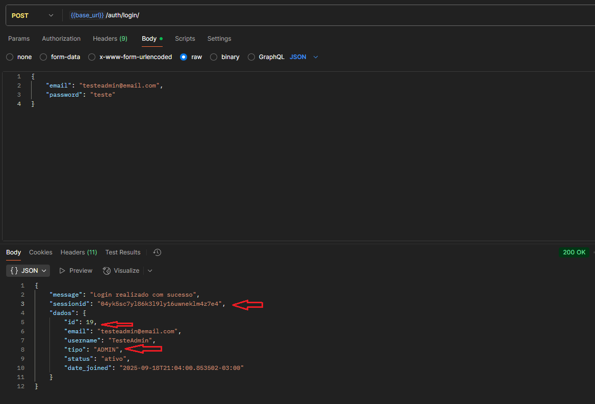</td>
  </tr>
  <tr>
    <td colspan="6" align="center"> 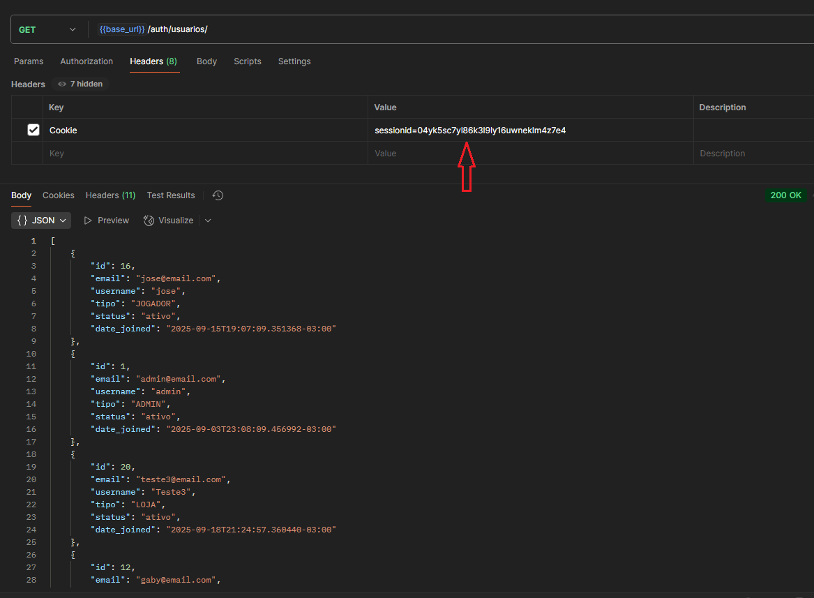</td>
  </tr>
</table>

<table>
  <tr>
    <th colspan="6" width="1000">CT-019-S  Cadastro com email e username válidos</th>
  </tr>
  <tr>
    <td width="170"><strong>Critérios de êxito</strong></td>
    <td colspan="5">O usuário deve conseguir se cadastrar na aplicação, recebendo um código 201 e uma parcela dos dados do usuário cadastrado.</td>
  </tr>
    <tr>
    <td><strong>Responsável pela funcionalidade (desenvolvimento e teste)</strong></td>
    <td width="430">Lucas Campos de Abreu </td>
     <td width="100"><strong>Data do Teste</strong></td>
    <td width="150">18/09/2025</td>
  </tr>
    <tr>
    <td width="170"><strong>Comentário</strong></td>
    <td colspan="5">A API retornou o código 201 e uma parcela dos dados do usuário cadastrado.</td>
  </tr>
  <tr>
    <td colspan="6" align="center"><strong>Evidência</strong></td>
  </tr>
  <tr>
    <td colspan="6" align="center"> 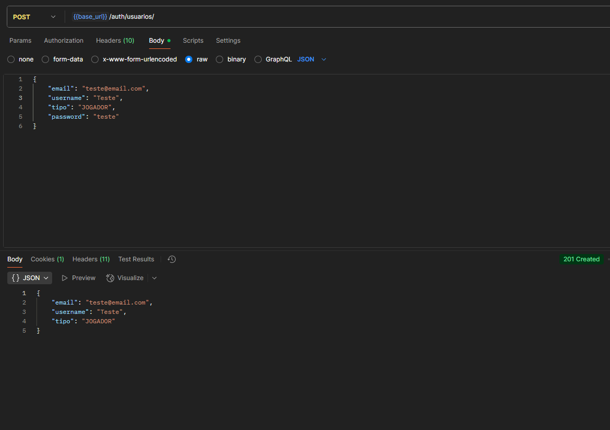</td>
  </tr>
</table>

<table>
  <tr>
    <th colspan="6" width="1000">CT-019-I  Cadastro com email e username inválidos</th>
  </tr>
  <tr>
    <td width="170"><strong>Critérios de êxito</strong></td>
    <td colspan="5">O usuário não deve conseguir se cadastrar na aplicação, recebendo um código 400 e uma mensagem de erro.</td>
  </tr>
    <tr>
    <td><strong>Responsável pela funcionalidade (desenvolvimento e teste)</strong></td>
    <td width="430">Lucas Campos de Abreu </td>
     <td width="100"><strong>Data do Teste</strong></td>
    <td width="150">18/09/2025</td>
  </tr>
    <tr>
    <td width="170"><strong>Comentário</strong></td>
    <td colspan="5">A API retornou o código 400 e uma mensagem de erro.</td>
  </tr>
  <tr>
    <td colspan="6" align="center"><strong>Evidência</strong></td>
  </tr>
  <tr>
    <td colspan="6" align="center"> </td>
  </tr>
</table>

### ETAPA 3
Colocar evidências de teste da etapa 3

### ETAPA 4
Colocar evidências de teste da etapa 4

## Parte 2 - Testes por pares
A fim de aumentar a qualidade da aplicação desenvolvida, cada funcionalidade deve ser testada por um colega e os testes devem ser evidenciados. O colega "Tester" deve utilizar o caso de teste criado pelo desenvolvedor responsável pela funcionalidade (desenvolveu a funcionalidade e criou o caso de testes descrito no plano de testes) e caso perceba a necessidade de outros casos de teste, deve acrescentá-los na sessão "Plano de Testes".

### ETAPA 2

### Exemplo
<table>
  <tr>
    <th colspan="6" width="1000">CT-001 (Exemplo) Exemplo Autenticação com credenciais válidas</th>
  </tr>
  <tr>
    <td width="170"><strong>Critérios de êxito</strong></td>
    <td colspan="5">O sistema deve redirecionar o usuário para a página inicial do aplicativo após o Autenticação bem-sucedido.</td>
  </tr>
    <tr>
      <td><strong>Responsável pela funcionalidade</strong></td>
    <td width="430">José da Silva </td>
      <td><strong>Responsável pelo teste</strong></td>
    <td width="430">Maria Oliveira </td>
     <td width="100"><strong>Data do teste</strong></td>
    <td width="150">08/05/2024</td>
  </tr>
    <tr>
    <td width="170"><strong>Comentário</strong></td>
    <td colspan="5">O sistema está permitindo o Autenticação corretamente.</td>
  </tr>
  <tr>
    <td colspan="6" align="center"><strong>Evidência</strong></td>
  </tr>
  <tr>
    <td colspan="6" align="center"><video src="https://github.com/ICEI-PUC-Minas-PMV-ADS/pmv-ads-2024-1-e5-proj-time-sheet/assets/82043220/2e3c1722-7adc-4bd4-8b4c-3abe9ddc1b48"/></td>
  </tr>
</table>

### ETAPA 3
Colocar evidências de teste da etapa 3

### ETAPA 4
Colocar evidências de teste da etapa 4

