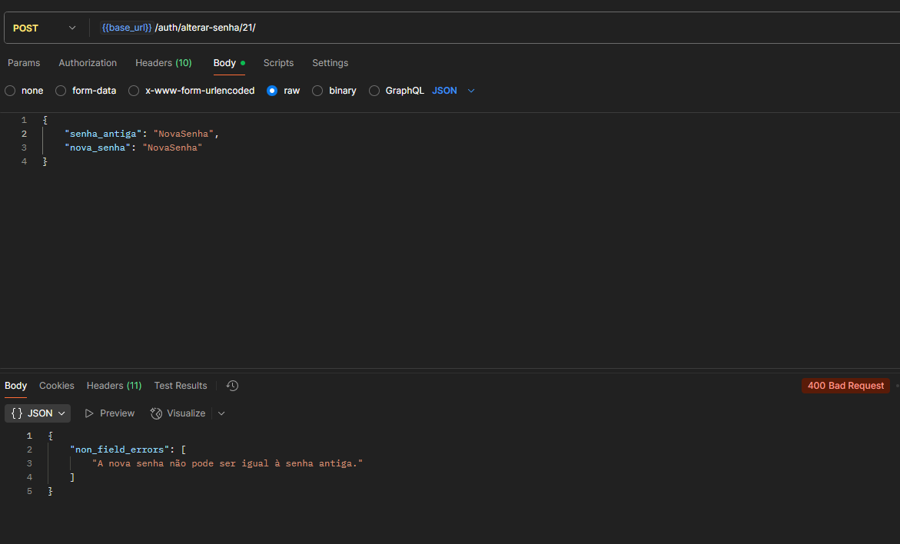
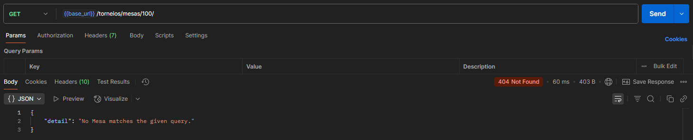
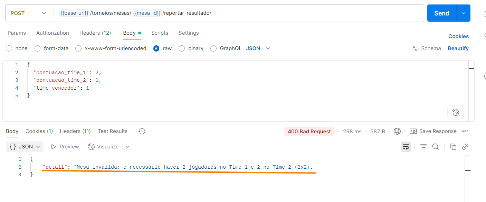

# Planos de Testes de Software
Este documento apresenta os casos de teste de **Sucesso** e **Insucesso** para a verificação e validação da aplicação.

### Tipo de Teste
- **Sucesso**: Tem o objetivo de verificar se as funcionalidades funcionam corretamente.
- **Insucesso**: Tem o objetivo de verificar se o sistema trata erros de maneira correta.

### ETAPA 2  

| Módulo        | Operação             | ID       | Cenário                               | Entrada                                             | Status Esperado | Assertivas Teste Unitário |
|---------------|----------------------|----------|---------------------------------------|-----------------------------------------------------|-----------------|---------------------------|
| Autenticação  | Realizar Login       | CT-001-S | Credenciais válidas                   | Email válido, senha válida                          | Sucesso         | Cria uma sessão e retorna os dados do usuário |
| Autenticação  | Realizar Login       | CT-001-I | Credenciais inválidas                 | Email válido, senha inválida                        | Insucesso       | Retorna código e mensagem de erro |
| Autenticação  | Recuperar senha      | CT-002-S | Recuperação com email válido          | Email cadastrado                                    | Sucesso         | Token enviado para email | 
| Autenticação  | Recuperar senha      | CT-002-I | Recuperação com email inválido        | Email não cadastrado                                | Insucesso       | Retorna código e mensagem de erro |
| Permissão     | Controlar Acesso     | CT-003-S | Acesso aos próprios dados             | SessionID atrelado ao dono dos dados                | Sucesso         | Retorna os dados requisitados |
| Permissão     | Controlar Acesso     | CT-003-I | Acesso a dados que pertencem a outro usuário                    | SessionID não atrelado ao dono dos dados                                  | Insucesso       | Retorna código e mensagem de erro |
| Torneio       | Inscrição            | CT-004-S | Jogador se inscreve                   | Dados válidos, torneio aberto                       | Sucesso         | Jogador inscrito |
| Torneio       | Inscrição            | CT-004-I | Inscrição fora do prazo               | Jogador válido, torneio encerrado                   | Insucesso       | Mensagem "Inscrição indisponível" |
| Torneio       | Desinscrição         | CT-005-S | Jogador se desinscreve                | Jogador inscrito, rodada entre turnos               | Sucesso         | Jogador removido |
| Torneio       | Desinscrição         | CT-005-I | Desinscrição fora do prazo            | Jogador inscrito, rodada em andamento               | Insucesso       | Mensagem "Desinscrição indisponível" |
| Loja          | Inscrição jogador    | CT-006-S | Inscrição pela loja                   | Jogador válido, torneio aberto                      | Sucesso         | Jogador inscrito pela loja |
| Loja          | Desinscrição jogador | CT-006-I | Desinscrição após término             | Jogador válido, torneio encerrado                   | Insucesso       | Mensagem de erro |
| Rodada        | Visualizar score     | CT-007-S | Visualização de mesas e score         | Rodada ativa                                        | Sucesso         | Exibe mesas e pontuação |
| Rodada        | Visualizar score     | CT-007-I | Erro ao carregar mesas                | Rodada inexistente                                  | Insucesso       | Mensagem "Dados indisponíveis" |
| Partida       | Reportar resultado   | CT-008-S | Reporte válido                        | Partida ativa, resultado válido                     | Sucesso         | Resultado registrado |
| Partida       | Reportar resultado   | CT-008-I | Reporte inválido                      | Resultado fora do padrão                            | Insucesso       | Mensagem de erro |
| Score         | Gerar tabela         | CT-009-S | Geração automática                    | Partidas válidas                                    | Sucesso         | Tabela de score atualizada |
| Score         | Gerar tabela         | CT-009-I | Falha ao atualizar tabela             | Dados corrompidos                                   | Insucesso       | Mensagem de falha |
| Loja          | Editar resultado     | CT-010-S | Edição válida                         | Resultado válido                                    | Sucesso         | Alteração salva |
| Loja          | Editar resultado     | CT-010-I | Edição inválida                       | Resultado incorreto                                 | Insucesso       | Mensagem de erro |
| Loja          | Gerenciar torneios   | CT-011-S | Criação válida de torneio             | Dados válidos                                       | Sucesso         | Torneio criado |
| Loja          | Gerenciar torneios   | CT-011-I | Criação inválida de torneio           | Nome vazio                                          | Insucesso       | Sistema rejeita criação |
| Partida       | Salvar dados         | CT-012-S | Salvamento automático                 | Partida válida                                      | Sucesso         | Dados salvos |
| Partida       | Salvar dados         | CT-012-I | Falha no salvamento                   | Erro de rede                                        | Insucesso       | Mensagem de falha |
| Mesas         | Editar manualmente   | CT-013-S | Edição válida                         | Mesa válida                                         | Sucesso         | Alteração salva |
| Mesas         | Editar manualmente   | CT-013-I | Edição inválida                       | Número de mesa inexistente                          | Insucesso       | Mensagem de erro |
| Pontuação     | Ajustar sistema      | CT-014-S | Ajuste válido                         | Critérios válidos                                   | Sucesso         | Sistema aplica novas regras |
| Pontuação     | Ajustar sistema      | CT-014-I | Ajuste inválido                       | Critérios fora do padrão                            | Insucesso       | Mensagem de erro |
| Autenticação  | Recuperar senha      | CT-015-S | Recuperação com token válido          | Token válido                                        | Sucesso         | Nova senha enviada para email |
| Autenticação  | Recuperar senha      | CT-015-I | Recuperação com token inválido        | Token inválido                                      | Insucesso       | Retorna código e mensagem de erro |
| Autenticação  | Alterar senha        | CT-016-S | Alteração de senha com senha atual válida          | Senha atual válida                     | Sucesso         | Altera a senha | 
| Autenticação  | Alterar senha        | CT-016-I | Alteração de senha com senha atual inválida        | Senha atual inválida                                | Insucesso       | Retorna código e mensagem de erro | 
| Autenticação  | Alterar senha        | CT-017-I | Alteração de senha com nova senha igual a senha atual        | Nova senha igual a senha atual                                | Insucesso       | Retorna código e mensagem de erro | 
| Permissão     | Controlar Acesso     | CT-018-S | Acesso a dados que pertencem a outro usuário sendo Admin             | ID de usuário com tipo ADMIN           | Sucesso         | Retorna os dados requisitados | 
| Autenticação  | Cadastro             | CT-019-S | Cadastro com email e usuário válidos  | Email e username válidos                            | Sucesso         | Cadastra o usuário no sistema |
| Autenticação  | Cadastro             | CT-019-I | Cadastro com email e/ou usuário inválidos       | Email e/ou username inválidos                                      | Insucesso       | Retorna código e mensagem de erro |
| Rodada  | Detalhes rodada      | CT-020-S | Capturar detalhes da rodada        | ID rodada existente                                      | Sucesso       | Retorna detalhes da rodada |
| Rodada  | Detalhes rodada      | CT-020-I | Procurar rodada inexistente        | ID rodada inexistente                                      | Insucesso       | Retorna 404 e mensagem de erro |
| Mesas  | Mesas da rodada      | CT-021-S | Detalhar todas as mesas de uma rodada        | ID rodada existente                                      | Sucesso       | Retorna mesas e jogadores na mesa |
| Mesas  | Mesas da rodada      | CT-021-I | Procurar mesas de rodada inexistente        | ID rodada inexistente                                    | Insucesso       | Retorna 404 e mensagem de erro |
| Mesas  | Detalhe mesa    | CT-022-S | Detalha a mesa e os jogadores      | ID mesa existente                                      | Sucesso       | Retorna detalhes da mesa e dos jogadores na mesa |
| Mesas  | Detalhe mesa    | CT-022-I | Procurar mesa inexistente      | ID mesa inexistente                                    | Insucesso       | Retorna 404 e mensagem de erro |
| Torneio  | Detalhes torneio      | CT-023-S | Capturar detalhes de um torneio        | ID torneio existente                                      | Sucesso       | Retorna detalhes do torneio |
| Torneio  | Detalhes torneio      | CT-023-I | Procurar torneio inexistente        | ID torneio inexistente                                      | Insucesso       | Retorna 404 e mensagem de erro |
| Torneio  | Reportar resultado      | CT-024-S | Reportar resultado corretamente    | Pontuação e time vencedor   | Sucesso       | Retorna os dados da mesa com o resultado correto |
| Torneio  | Reportar resultado     | CT-024-I | Reportar resultado corretamente    | ID de rodada em andamento       | Insucesso       | Retorna 403 e mensagem de erro |
| Torneio  | Loja edita resultado  | CT-025-s | Eviar resultado de rodad em andamento    | Pontuação e time vencedor       | Sucesso       | Retorna os dados da mesa com o resultado |
| Torneio  | Loja edita resultado     | CT-025-I | Eviar ID de rodada inexistente    | ID de rodada inexistente      | Insucesso       | Retorna 404 e mensagem de erro |

### ETAPA 3
| Módulo        | Operação             | ID       | Cenário                               | Entrada                                             | Status Esperado | Assertivas Teste por Pares | Desenvolvedor | Testador | 
|---------------|----------------------|----------|---------------------------------------|-----------------------------------------------------|-----------------|----------------------------|----------------------------|----------------------------|
| Autenticação  | Realizar Login       | CT-026-S | Credenciais válidas                   | Email válido, senha válida                          | Sucesso  | Redireciona o usuário para a tela inicial ou tela requisitada antes da autenticação | Lucas |
| Autenticação  | Realizar Login       | CT-026-I | Credenciais inválidas                 | Email válido, senha inválida                        | Insucesso       | Alerta de falha aparece na tela com a mensagem de erro | Lucas |
| Autenticação  | Recuperar senha      | CT-027-S | Recuperação com email válido          | Email cadastrado                                    | Sucesso         | Token enviado para email | Lucas |
| Autenticação  | Recuperar senha      | CT-027-I | Recuperação com email inválido        | Email não cadastrado                                | Insucesso       | Alerta de falha aparece na tela com a mensagem de erro | Lucas |
| Permissão     | Controlar Acesso     | CT-028-S | Acesso aos próprios dados             | SessionID atrelado ao dono dos dados                | Sucesso         | Usuário tem acesso aos próprios dados da rotina acessada na tela| Lucas |
| Permissão     | Controlar Acesso     | CT-028-I | Acesso a dados que pertencem a outro usuário                    | SessionID não atrelado ao dono dos dados    | Insucesso       | Alerta de falha aparece na tela com a mensagem de erro | Lucas |
| Autenticação  | Recuperar senha      | CT-029-S | Recuperação com token válido          | Token válido                                        | Sucesso         | Nova senha enviada para email | Lucas |
| Autenticação  | Recuperar senha      | CT-029-I | Recuperação com token inválido        | Token inválido                                      | Insucesso       | Alerta de falha aparece na tela com a mensagem de erro | Lucas |
| Autenticação  | Alterar senha        | CT-030-S | Alteração de senha com senha atual válida          | Senha atual válida                     | Sucesso         | Usuário consegue alterar a senha | Lucas |
| Autenticação  | Alterar senha        | CT-030-I | Alteração de senha com senha atual inválida        | Senha atual inválida                                | Insucesso       |Alerta de falha aparece na tela com a mensagem de erro | Lucas |
| Autenticação  | Alterar senha        | CT-031-I | Alteração de senha com nova senha igual a senha atual        | Nova senha igual a senha atual                                | Insucesso       |  Alerta de falha aparece na tela com a mensagem de erro | Lucas |
| Permissão     | Controlar Acesso     | CT-031-S | Acesso a dados que pertencem a outro usuário sendo Admin             | ID de usuário com tipo ADMIN           | Sucesso         | Acessa aos dados de todos os usuários pela interface administrativa | Lucas |
| Autenticação  | Cadastro             | CT-032-S | Cadastro com email e usuário válidos  | Email e username válidos                            | Sucesso         | Cadastra o usuário no sistema |  Lucas |
| Autenticação  | Cadastro             | CT-032-I | Cadastro com email e/ou usuário inválidos       | Email e/ou username inválidos                                      | Insucesso       | Alerta de falha aparece na tela com a mensagem de erro | Lucas |
| Torneio  | Buscar Torneio            | CT-033-S   | Torneio existente             | ID de torneio válido                                   | Sucesso     | Exibe ao abrir a tela Informação do Torneio nome, status, regras e lista de jogadores | Gabriela |
| Torneio  | Buscar Torneio          | CT-033-I   | Torneio inexistente     | ID de torneio inexistente                              | Insucesso       | Exibe mensagem “Erro ao buscar torneio.” | Gabriela |
| Torneio  | Editar Regras           | CT-034-S   | Atualização bem-sucedida | Texto válido de regras                                 | Sucesso    | Regras atualizadas e mensagem de sucesso exibida | Gabriela |
| Torneio  | Editar Regras           | CT-034-I   | Falha ao salvar regras   | Texto de regras + erro 500                             | Insucesso  | Exibe mensagem “Erro ao salvar regras.” E não atualiza as regras salvas. | Gabriela |
| Torneio  | Listar Jogadores                   | CT-035-S   | Jogadores inscritos   | Lista retornada pela API  | Sucesso         | Exibe nomes dos jogadores inscritos no torneio | Gabriela |
| Torneio  | Listar Jogadores                   | CT-035-I   | Jogadores inscritos   | Lista retornada pela API  | Insucesso         | Exibe a mensagem  “Nenhum jogador inscrito ainda”| Gabriela |
| Torneio | Exibir Detalhes da Mesa          | CT-036-S   | Mesas com jogadores válidos                    | Dados de emparelhamento retornados da API             | Sucesso         | Exibe corretamente número da mesa e jogadores | Gabriela |
| Torneio | Exibir Detalhes da Mesa          | CT-036-I   | Mesas com jogadores válidos                    | Dados de emparelhamento retornados da API             | Insucesso         | Exibe a mensagem "Nenhuma mesa emparelhada para esta rodada." | Gabriela |
| Torneio | Carregar Dados | CT-037-S | Carregamento bem-sucedido, LOJA | LOJA logada com torneios existentes | Sucesso | Exibe lista de torneios organizada por status | Willams       |  |
| Torneio | Carregar Dados | CT-037-I | Carregamento falha, LOJA | LOJA logada com erro de API | Insucesso | Exibe mensagem "Não foi possível carregar seus torneios." | Willams       |  |
| Torneio | Visualizar Histórico | CT-038-S-1 | LOJA visualiza Seus Torneios sem torneios abertos | LOJA logada, sem torneios no status "Aberto" | Sucesso | Exibe mensagem "Você ainda não tem torneios abertos." | Willams |  |
| Torneio | Visualizar Histórico | CT-038-S-2 | LOJA visualiza Seus Torneios com torneios abertos | LOJA logada, com torneios no status "Aberto" | Sucesso | Exibe lista de torneios abertos da loja com status "Aberto" | Willams |  |
| Torneio | Visualizar Histórico | CT-039-S | JOGADOR visualiza Torneios Inscritos | JOGADOR logado, inscrito em torneios abertos | Sucesso | Exibe lista de torneios inscritos com status "Inscrito" | Willams |  |
| Torneio | Visualizar Histórico | CT-039-I | JOGADOR não visualiza Torneios Inscritos | JOGADOR logado, não inscrito em torneios | Insucesso | Exibe mensagem "Você não está inscrito em nenhum torneio no momento." | Willams |  |
| Torneio | Desinscrever-se de Torneio| CT-040-S | JOGADOR desinscreve-se de torneio com sucesso | JOGADOR logado, acessa Torneios Inscritos, clica "Desinscrever-se" | Sucesso | Remove torneio da lista | Willams |  |
| Torneio | Desinscrever-se de Torneio| CT-040-I | JOGADOR falha ao desinscrever-se | JOGADOR logado, tenta desinscrever com erro de API | Insucesso | Exibe mensagem "Não foi possível desinscrever-se do torneio." | Willams |  |
| Torneio | Visualizar torneio e rodadas | CT-041-S | Logado com a loja responsável pelo torneio | Loja logada clica nos detalhes do torneio | Sucesso | Conteúdo do torneio e rodadas é renderizado | Guilherme
| Torneio | Visualizar torneio e rodadas | CT-041-I | Logado com a loja não responsável pelo torneio | Loja logada acessa url do torneio | Insucesso | Mensagem torneio não encontrado | Guilherme
| Torneio | Confirmar resultado | CT-042-S | Loja confirma resultado | Loja abre modal e confirma resultado | Sucesso | Mensagem de sucesso e altera status da mesa para finalizado | Guilherme
| Torneio | Visualizar mesa | CT-043-S | Jogador visualiza mesa ativa | Jogador clica no torneio | Sucesso | Renderiza mesa ativa do torneio clicado | Guilherme
| Torneio | Visualizar mesa | CT-043-I | Jogador visualiza mesa ativa | Jogador acessa mesa inexistente pela url | Insucesso | Mensagem mesa não encontrada | Guilherme
| Torneio | Visualizar mesa | CT-044-S | Jogador confirma resultado | Jogador informa o resultado e confirma | Sucesso | Mensagem sucesso e altera a renderização para visualização | Guilherme
| Loja          | Gerenciar torneios   | CT-045-S | Criação válida de torneio             | Dados válidos                                       | Sucesso         | Torneio criado | Rafael
| Loja          | Gerenciar torneios   | CT-045-I | Criação inválida de torneio           | Nome vazio                                          | Insucesso       | Sistema rejeita criação | Rafael
| Torneio       | Inscrição            | CT-046-S | Jogador se inscreve                   | Dados válidos, torneio aberto                       | Sucesso         | Jogador inscrito | Rafael
| Torneio       | Inscrição            | CT-046-I | Inscrição fora do prazo               | Jogador válido, torneio encerrado                   | Insucesso       | Mensagem Mensagem de erro | Rafael
| Loja          | Inscrição jogador    | CT-048-S | Inscrição pela loja                   | Jogador válido, torneio aberto                      | Sucesso         | Jogador inscrito pela loja | Rafael
| Loja          | Inscrição jogador | CT-048-I | Inscrição fora do prazo             | Jogador válido, torneio encerrado                   | Insucesso       | Mensagem de erro | Rafael

### ETAPA 4
Criar casos de teste da etapa 4
 
# Evidências de Testes de Software

Apresentação de imagens e/ou vídeos que comprovam que um determinado teste foi executado, e o resultado esperado foi obtido.

## Parte 1 - Testes de desenvolvimento
Cada funcionalidade desenvolvida deve ser testada pelo próprio desenvolvedor, utilizando casos de teste, tanto de sucesso quanto de insucesso, elaborados por ele. Todos os testes devem ser evidenciados.

### ETAPA 2

<!-- Teste Gaby -->
<table>
  <tr>
    <th colspan="6" width="1000">CT-011-S - A loja pode criar e gerenciar torneios</th>
  </tr>
  <tr>
    <td width="170"><strong>Critérios de êxito</strong></td>
    <td colspan="5">A loja deve conseguir criar o torneio</td>
  </tr>
    <tr>
    <td><strong>Responsável pela funcionalidade (desenvolvimento e teste)</strong></td>
    <td width="430">Gabriela Franklin Sá de Moura </td>
     <td width="100"><strong>Data do Teste</strong></td>
    <td width="150">17/09/2025</td>
  </tr>
    <tr>
    <td width="170"><strong>Comentário</strong></td>
    <td colspan="5">O teste foi realizado no Swagger, onde é possível ver que a inscrição do torneio feita por um usuário loja foi um sucesso(200). As evidências estão na ordem da requisição</td>
  </tr>
  <tr>
    <td colspan="6" align="center"><strong>Evidência</strong></td>
  </tr>
  <tr>
    <td colspan="6" align="center">Imagem 1</td>
  </tr>
  <tr> 
   <td colspan="6" align="center">Imagem 2</td>   
  </tr>
</table>

<table>
  <tr>
    <th colspan="6" width="1000">CT-011-I - A loja pode criar e gerenciar torneios</th>
  </tr>
  <tr>
    <td width="170"><strong>Critérios de êxito</strong></td>
    <td colspan="5">A loja não deve conseguir criar o torneio</td>
  </tr>
    <tr>
    <td><strong>Responsável pela funcionalidade (desenvolvimento e teste)</strong></td>
    <td width="430">Gabriela Franklin Sá de Moura </td>
     <td width="100"><strong>Data do Teste</strong></td>
    <td width="150">17/09/2025</td>
  </tr>
    <tr>
    <td width="170"><strong>Comentário</strong></td>
    <td colspan="5">O teste foi realizado no Swagger, onde é possível ver que a inscrição do torneio não conseguiu ser efetuada(400), pois não foi informado o nome do torneio. As evidências estão na ordem da requisição</td>
  </tr>
  <tr>
    <td colspan="6" align="center"><strong>Evidência</strong></td>
  </tr>
  <tr>
    <td colspan="6" align="center">Imagem 1</td>
  </tr>
  <tr> 
   <td colspan="6" align="center">Imagem 2</td>   
  </tr>
</table>

<table>
  <tr>
    <th colspan="6" width="1000">CT-014-S - A loja pode ajustar o sistema de pontuação do torneio</th>
  </tr>
  <tr>
    <td width="170"><strong>Critérios de êxito</strong></td>
    <td colspan="5">A loja deve conseguir ajustar a pontuação de uma mesa em uma rodada específica do torneio</td>
  </tr>
    <tr>
    <td><strong>Responsável pela funcionalidade (desenvolvimento e teste)</strong></td>
    <td width="430">Gabriela Franklin Sá de Moura </td>
     <td width="100"><strong>Data do Teste</strong></td>
    <td width="150">17/09/2025</td>
  </tr>
    <tr>
    <td width="170"><strong>Comentário</strong></td>
    <td colspan="5">O teste foi realizado no Swagger, onde é possível ver que a alteração da pontuação dos times feita por um usuário loja foi um sucesso(200). As evidências estão na ordem da requisição, sendo que a primeira evidencia mostra como estavam os resultados originais no banco de dados.</td>
  </tr>
  <tr>
    <td colspan="6" align="center"><strong>Evidência</strong></td>
  </tr>
  <tr>
    <td colspan="6" align="center">Imagem 1 </td>
  </tr>
  <tr> 
   <td colspan="6" align="center">Imagem 2</td>   
  </tr>
   <tr> 
   <td colspan="6" align="center">Imagem 3</td>   
  </tr>
</table>

<table>
  <tr>
    <th colspan="6" width="1000">CT-014-I - A loja pode ajustar o sistema de pontuação do torneio</th>
  </tr>
  <tr>
    <td width="170"><strong>Critérios de êxito</strong></td>
    <td colspan="5">A loja  não deve conseguir ajustar a pontuação de uma mesa em uma rodada específica do torneio</td>
  </tr>
    <tr>
    <td><strong>Responsável pela funcionalidade (desenvolvimento e teste)</strong></td>
    <td width="430">Gabriela Franklin Sá de Moura </td>
     <td width="100"><strong>Data do Teste</strong></td>
    <td width="150">17/09/2025</td>
  </tr>
    <tr>
    <td width="170"><strong>Comentário</strong></td>
    <td colspan="5">O teste foi realizado no Swagger, onde é possível ver que a alteração da pontuação dos times feita por um usuário loja nâo foi efetuada(400), devido a alteração na pontuação, o que não foi permitido naquela mesa.</td>
  </tr>
  <tr>
    <td colspan="6" align="center"><strong>Evidência</strong></td>
  </tr>
  <tr>
    <td colspan="6" align="center">Imagem 1 </td>
  </tr>
  <tr> 
   <td colspan="6" align="center">Imagem 2</td>   
  </tr>
</table>

<!-- Testes Lucas -->
<table>
  <tr>
    <th colspan="6" width="1000">CT-001-S  Autenticação com credenciais válidas</th>
  </tr>
  <tr>
    <td width="170"><strong>Critérios de êxito</strong></td>
    <td colspan="5">O usuário deve conseguir se autenticar na aplicação, recebendo um código 200, a sessionID e seus dados no retorno da requisição.</td>
  </tr>
    <tr>
    <td><strong>Responsável pela funcionalidade (desenvolvimento e teste)</strong></td>
    <td width="430">Lucas Campos de Abreu </td>
     <td width="100"><strong>Data do Teste</strong></td>
    <td width="150">18/09/2025</td>
  </tr>
    <tr>
    <td width="170"><strong>Comentário</strong></td>
    <td colspan="5">A API retornou o código 200, dados do usuário que foi autenticado e criou um sessionID com sucesso.</td>
  </tr>
  <tr>
    <td colspan="6" align="center"><strong>Evidência</strong></td>
  </tr>
  <tr>
    <td colspan="6" align="center"> </td>
  </tr>
</table>

<table>
  <tr>
    <th colspan="6" width="1000">CT-001-I  Autenticação com credenciais inválidas</th>
  </tr>
  <tr>
    <td width="170"><strong>Critérios de êxito</strong></td>
    <td colspan="5">O usuário não deve conseguir se autenticar na aplicação, recebendo um código 401 e uma mensagem de erro.</td>
  </tr>
    <tr>
    <td><strong>Responsável pela funcionalidade (desenvolvimento e teste)</strong></td>
    <td width="430">Lucas Campos de Abreu </td>
     <td width="100"><strong>Data do Teste</strong></td>
    <td width="150">18/09/2025</td>
  </tr>
    <tr>
    <td width="170"><strong>Comentário</strong></td>
    <td colspan="5">A API retornou o código 401 e uma mensagem de erro.</td>
  </tr>
  <tr>
    <td colspan="6" align="center"><strong>Evidência</strong></td>
  </tr>
  <tr>
    <td colspan="6" align="center"> </td>
  </tr>
</table>

<table>
  <tr>
    <th colspan="6" width="1000">CT-002-S  Recuperação de senha com email válido</th>
  </tr>
  <tr>
    <td width="170"><strong>Critérios de êxito</strong></td>
    <td colspan="5">O usuário deve receber um token de validação em seu email.</td>
  </tr>
    <tr>
    <td><strong>Responsável pela funcionalidade (desenvolvimento e teste)</strong></td>
    <td width="430">Lucas Campos de Abreu </td>
     <td width="100"><strong>Data do Teste</strong></td>
    <td width="150">18/09/2025</td>
  </tr>
    <tr>
    <td width="170"><strong>Comentário</strong></td>
    <td colspan="5">O usuário recebeu seu token de validação por email, além de um código 200 e uma mensagem de êxito na response da API.</td>
  </tr>
  <tr>
    <td colspan="6" align="center"><strong>Evidência</strong></td>
  </tr>
  <tr>
    <td colspan="6" align="center"> </td>
  </tr>
  <tr>
    <td colspan="6" align="center"> </td>
  </tr>
</table>

<table>
  <tr>
    <th colspan="6" width="1000">CT-002-I  Recuperação de senha com email inválido</th>
  </tr>
  <tr>
    <td width="170"><strong>Critérios de êxito</strong></td>
    <td colspan="5">O usuário não deve receber o token por email, recebendo um código 400 e uma mensagem de erro.</td>
  </tr>
    <tr>
    <td><strong>Responsável pela funcionalidade (desenvolvimento e teste)</strong></td>
    <td width="430">Lucas Campos de Abreu </td>
     <td width="100"><strong>Data do Teste</strong></td>
    <td width="150">18/09/2025</td>
  </tr>
    <tr>
    <td width="170"><strong>Comentário</strong></td>
    <td colspan="5">A API retornou o código 400 e uma mensagem de erro.</td>
  </tr>
  <tr>
    <td colspan="6" align="center"><strong>Evidência</strong></td>
  </tr>
  <tr>
    <td colspan="6" align="center"> </td>
  </tr>
</table>

<table>
  <tr>
    <th colspan="6" width="1000">CT-003-S  Acesso aos própios dados</th>
  </tr>
  <tr>
    <td width="170"><strong>Critérios de êxito</strong></td>
    <td colspan="5">O usuário deve receber os dados requisitados.</td>
  </tr>
    <tr>
    <td><strong>Responsável pela funcionalidade (desenvolvimento e teste)</strong></td>
    <td width="430">Lucas Campos de Abreu </td>
     <td width="100"><strong>Data do Teste</strong></td>
    <td width="150">18/09/2025</td>
  </tr>
    <tr>
    <td width="170"><strong>Comentário</strong></td>
    <td colspan="5">O usuário recebeu os dados requisitados, além de um código 200 e uma mensagem de êxito na response da API, visto que o sessionID enviado na requisição está atrelado ao dono dos dados requisitados.</td>
  </tr>
  <tr>
    <td colspan="6" align="center"><strong>Evidência</strong></td>
  </tr>
  <tr>
    <td colspan="6" align="center"> </td>
  </tr>
   <tr>
    <td colspan="6" align="center"> </td>
  </tr>
</table>

<table>
  <tr>
    <th colspan="6" width="1000">CT-003-I  Acesso aos dados de outro usuário</th>
  </tr>
  <tr>
    <td width="170"><strong>Critérios de êxito</strong></td>
    <td colspan="5">O usuário não deve receber os dados requisitados.</td>
  </tr>
    <tr>
    <td><strong>Responsável pela funcionalidade (desenvolvimento e teste)</strong></td>
    <td width="430">Lucas Campos de Abreu </td>
     <td width="100"><strong>Data do Teste</strong></td>
    <td width="150">18/09/2025</td>
  </tr>
    <tr>
    <td width="170"><strong>Comentário</strong></td>
    <td colspan="5">A API retornou o código 403 e uma mensagem de erro.</td>
  </tr>
  <tr>
    <td colspan="6" align="center"><strong>Evidência</strong></td>
  </tr>
  <tr>
    <td colspan="6" align="center"> </td>
  </tr>
  <tr>
    <td colspan="6" align="center"> </td>
  </tr>
</table>

<table> <tr> <th colspan="6" width="1000">CT-004-S  Inscrição em torneio</th> </tr> <tr> <td width="170"><strong>Critérios de êxito</strong></td> <td colspan="5">Jogador deve ser inscrito com sucesso quando o torneio estiver aberto e os dados forem válidos.</td> </tr> <tr> <td><strong>Responsável pela funcionalidade (desenvolvimento e teste)</strong></td> <td width="430">Rafael Costa Souza</td> <td width="100"><strong>Data do Teste</strong></td> <td width="150">12/10/2025</td> </tr> <tr> <td width="170"><strong>Comentário</strong></td> <td colspan="5">A inscrição foi concluída com sucesso. O sistema retornou status 200 e o jogador foi incluído na lista de inscritos do torneio.</td> </tr> <tr> <td colspan="6" align="center"><strong>Evidência</strong></td> </tr> <tr> <td colspan="6" align="center"> </td> </tr> </table>

<table> <tr> <th colspan="6" width="1000">CT-004-I  Inscrição fora do prazo</th> </tr> <tr> <td width="170"><strong>Critérios de êxito</strong></td> <td colspan="5">Jogadores não devem conseguir se inscrever em torneios encerrados.</td> </tr> <tr> <td><strong>Responsável pela funcionalidade (desenvolvimento e teste)</strong></td> <td width="430">Rafael Costa Souza</td> <td width="100"><strong>Data do Teste</strong></td> <td width="150">12/10/2025</td> </tr> <tr> <td width="170"><strong>Comentário</strong></td> <td colspan="5">O sistema retorna código 400 e mensagem de erro “Não é possível se inscrever: a data de início do torneio já passou.” com código 400.</td> </tr> <tr> <td colspan="6" align="center"><strong>Evidência</strong></td> </tr> <tr> <td colspan="6" align="center"> </td> </tr> </table>

<table> <tr> <th colspan="6" width="1000">CT-005-S  Desinscrição de torneio</th> </tr> <tr> <td width="170"><strong>Critérios de êxito</strong></td> <td colspan="5">Jogador deve conseguir se desinscrever de torneios entre turnos, desde que já esteja inscrito.</td> </tr> <tr> <td><strong>Responsável pela funcionalidade (desenvolvimento e teste)</strong></td> <td width="430">Rafael Costa Souza</td> <td width="100"><strong>Data do Teste</strong></td> <td width="150">12/10/2025</td> </tr> <tr> <td width="170"><strong>Comentário</strong></td> <td colspan="5">A desinscrição foi realizada com sucesso e o jogador foi removido da lista de participantes.</td> </tr> <tr> <td colspan="6" align="center"><strong>Evidência</strong></td> </tr> <tr> <td colspan="6" align="center"> </td> </tr> </table>

<table> <tr> <th colspan="6" width="1000">CT-005-I  Desinscrição fora do prazo</th> </tr> <tr> <td width="170"><strong>Critérios de êxito</strong></td> <td colspan="5">Jogadores não devem conseguir se desinscrever de torneios com rodada em andamento.</td> </tr> <tr> <td><strong>Responsável pela funcionalidade (desenvolvimento e teste)</strong></td> <td width="430">Rafael Costa Souza</td> <td width="100"><strong>Data do Teste</strong></td> <td width="150">12/10/2025</td> </tr> <tr> <td width="170"><strong>Comentário</strong></td> <td colspan="5">O sistema retorna código 400 e mensagem de erro ao tentar remover o jogador durante uma rodada ativa.</td> </tr> <tr> <td colspan="6" align="center"><strong>Evidência</strong></td> </tr> <tr> <td colspan="6" align="center"> </td> </tr> </table>

<table> <tr> <th colspan="6" width="1000">CT-006-S  Inscrição pela loja</th> </tr> <tr> <td width="170"><strong>Critérios de êxito</strong></td> <td colspan="5">A loja deve conseguir inscrever jogadores em torneios abertos com dados válidos.</td> </tr> <tr> <td><strong>Responsável pela funcionalidade (desenvolvimento e teste)</strong></td> <td width="430">Rafael Costa Souza</td> <td width="100"><strong>Data do Teste</strong></td> <td width="150">12/10/2025</td> <td width="150">18/09/2025</td> </tr> <tr> <td width="170"><strong>Comentário</strong></td> <td colspan="5">A inscrição via loja foi bem-sucedida e o jogador foi registrado corretamente no torneio.</td> </tr> <tr> <td colspan="6" align="center"><strong>Evidência</strong></td> </tr> <tr> <td colspan="6" align="center"> </td> </tr> </table>

<table> <tr> <th colspan="6" width="1000">CT-006-I  Desinscrição após término do torneio</th> </tr> <tr> <td width="170"><strong>Critérios de êxito</strong></td> <td colspan="5">Não deve ser possível desinscrever jogadores após o término do torneio.</td> </tr> <tr> <td><strong>Responsável pela funcionalidade (desenvolvimento e teste)</strong></td> <td width="430">Rafael Costa Souza</td> <td width="100"><strong>Data do Teste</strong></td> <td width="150">12/10/2025</td> </tr> <tr> <td width="170"><strong>Comentário</strong></td> <td colspan="5">O sistema retorna código 400 e mensagem de erro ao tentar realizar a desinscrição após o término do torneio.</td> </tr> <tr> <td colspan="6" align="center"><strong>Evidência</strong></td> </tr> <tr> <td colspan="6" align="center"> </td> </tr> </table>

<table>
  <tr>
    <th colspan="6" width="1000">CT-015-S  Recuperação de senha com token válido</th>
  </tr>
  <tr>
    <td width="170"><strong>Critérios de êxito</strong></td>
    <td colspan="5">O usuário deve receber a nova senha em seu email.</td>
  </tr>
    <tr>
    <td><strong>Responsável pela funcionalidade (desenvolvimento e teste)</strong></td>
    <td width="430">Lucas Campos de Abreu </td>
     <td width="100"><strong>Data do Teste</strong></td>
    <td width="150">18/09/2025</td>
  </tr>
    <tr>
    <td width="170"><strong>Comentário</strong></td>
    <td colspan="5">O usuário recebeu sua nova senha por email, além de um código 200 e uma mensagem de êxito na response da API.</td>
  </tr>
  <tr>
    <td colspan="6" align="center"><strong>Evidência</strong></td>
  </tr>
  <tr>
    <td colspan="6" align="center"> </td>
  </tr>
  <tr>
    <td colspan="6" align="center"> </td>
  </tr>
   <tr>
    <td colspan="6" align="center"> </td>
  </tr>
  <tr>
    <td colspan="6" align="center"> </td>
  </tr>
</table>

<table>
  <tr>
    <th colspan="6" width="1000">CT-015-I  Recuperação de senha com token inválido</th>
  </tr>
  <tr>
    <td width="170"><strong>Critérios de êxito</strong></td>
    <td colspan="5">O usuário não deve receber a nova senha em seu email.</td>
  </tr>
    <tr>
    <td><strong>Responsável pela funcionalidade (desenvolvimento e teste)</strong></td>
    <td width="430">Lucas Campos de Abreu </td>
     <td width="100"><strong>Data do Teste</strong></td>
    <td width="150">18/09/2025</td>
  </tr>
    <tr>
    <td width="170"><strong>Comentário</strong></td>
    <td colspan="5">A API retornou o código 400 e uma mensagem de erro.</td>
  </tr>
  <tr>
    <td colspan="6" align="center"><strong>Evidência</strong></td>
  </tr>
  <tr>
    <td colspan="6" align="center"> </td>
  </tr>
</table>

<table>
  <tr>
    <th colspan="6" width="1000">CT-016-S  Alteração de senha com senha atual válida</th>
  </tr>
  <tr>
    <td width="170"><strong>Critérios de êxito</strong></td>
    <td colspan="5">O usuário deve conseguir alterar sua senha.</td>
  </tr>
    <tr>
    <td><strong>Responsável pela funcionalidade (desenvolvimento e teste)</strong></td>
    <td width="430">Lucas Campos de Abreu </td>
     <td width="100"><strong>Data do Teste</strong></td>
    <td width="150">18/09/2025</td>
  </tr>
    <tr>
    <td width="170"><strong>Comentário</strong></td>
    <td colspan="5">O usuário conseguiu realizar a alteração da senha, além de um código 200 e uma mensagem de êxito na response da API.</td>
  </tr>
  <tr>
    <td colspan="6" align="center"><strong>Evidência</strong></td>
  </tr>
  <tr>
    <td colspan="6" align="center"> </td>
  </tr>
</table>

<table>
  <tr>
    <th colspan="6" width="1000">CT-016-I  Alteração de senha com senha atual inválida</th>
  </tr>
  <tr>
    <td width="170"><strong>Critérios de êxito</strong></td>
    <td colspan="5">O usuário não deve conseguir alterar sua senha.</td>
  </tr>
    <tr>
    <td><strong>Responsável pela funcionalidade (desenvolvimento e teste)</strong></td>
    <td width="430">Lucas Campos de Abreu </td>
     <td width="100"><strong>Data do Teste</strong></td>
    <td width="150">18/09/2025</td>
  </tr>
    <tr>
    <td width="170"><strong>Comentário</strong></td>
    <td colspan="5">A API retornou o código 400 e uma mensagem de erro.</td>
  </tr>
  <tr>
    <td colspan="6" align="center"><strong>Evidência</strong></td>
  </tr>
  <tr>
    <td colspan="6" align="center"> </td>
  </tr>
</table>

<table>
  <tr>
    <th colspan="6" width="1000">CT-017-I  Alteração de senha com nova senha igual a senha atual</th>
  </tr>
  <tr>
    <td width="170"><strong>Critérios de êxito</strong></td>
    <td colspan="5">O usuário não deve conseguir alterar sua senha.</td>
  </tr>
    <tr>
    <td><strong>Responsável pela funcionalidade (desenvolvimento e teste)</strong></td>
    <td width="430">Lucas Campos de Abreu </td>
     <td width="100"><strong>Data do Teste</strong></td>
    <td width="150">18/09/2025</td>
  </tr>
    <tr>
    <td width="170"><strong>Comentário</strong></td>
    <td colspan="5">A API retornou o código 400 e uma mensagem de erro.</td>
  </tr>
  <tr>
    <td colspan="6" align="center"><strong>Evidência</strong></td>
  </tr>
  <tr>
    <td colspan="6" align="center"> </td>
  </tr>
</table>

<table>
  <tr>
    <th colspan="6" width="1000">CT-018-S  Acesso aos dados de outro usuário sendo administrador do sistema (ADMIN)</th>
  </tr>
  <tr>
    <td width="170"><strong>Critérios de êxito</strong></td>
    <td colspan="5">O usuário deve receber os dados requisitados.</td>
  </tr>
    <tr>
    <td><strong>Responsável pela funcionalidade (desenvolvimento e teste)</strong></td>
    <td width="430">Lucas Campos de Abreu </td>
     <td width="100"><strong>Data do Teste</strong></td>
    <td width="150">18/09/2025</td>
  </tr>
    <tr>
    <td width="170"><strong>Comentário</strong></td>
    <td colspan="5">O usuário recebeu os dados requisitados, além de um código 200 e uma mensagem de êxito na response da API, visto que o sessionID enviado na requisição está atrelado a um usuário do tipo ADMIN.</td>
  </tr>
  <tr>
    <td colspan="6" align="center"><strong>Evidência</strong></td>
  </tr>
  <tr>
    <td colspan="6" align="center"> </td>
  </tr>
  <tr>
    <td colspan="6" align="center"> </td>
  </tr>
</table>

<table>
  <tr>
    <th colspan="6" width="1000">CT-019-S  Cadastro com email e username válidos</th>
  </tr>
  <tr>
    <td width="170"><strong>Critérios de êxito</strong></td>
    <td colspan="5">O usuário deve conseguir se cadastrar na aplicação, recebendo um código 201 e uma parcela dos dados do usuário cadastrado.</td>
  </tr>
    <tr>
    <td><strong>Responsável pela funcionalidade (desenvolvimento e teste)</strong></td>
    <td width="430">Lucas Campos de Abreu </td>
     <td width="100"><strong>Data do Teste</strong></td>
    <td width="150">18/09/2025</td>
  </tr>
    <tr>
    <td width="170"><strong>Comentário</strong></td>
    <td colspan="5">A API retornou o código 201 e uma parcela dos dados do usuário cadastrado.</td>
  </tr>
  <tr>
    <td colspan="6" align="center"><strong>Evidência</strong></td>
  </tr>
  <tr>
    <td colspan="6" align="center"> </td>
  </tr>
</table>

<table>
  <tr>
    <th colspan="6" width="1000">CT-019-I  Cadastro com email e username inválidos</th>
  </tr>
  <tr>
    <td width="170"><strong>Critérios de êxito</strong></td>
    <td colspan="5">O usuário não deve conseguir se cadastrar na aplicação, recebendo um código 400 e uma mensagem de erro.</td>
  </tr>
    <tr>
    <td><strong>Responsável pela funcionalidade (desenvolvimento e teste)</strong></td>
    <td width="430">Lucas Campos de Abreu </td>
     <td width="100"><strong>Data do Teste</strong></td>
    <td width="150">18/09/2025</td>
  </tr>
    <tr>
    <td width="170"><strong>Comentário</strong></td>
    <td colspan="5">A API retornou o código 400 e uma mensagem de erro.</td>
  </tr>
  <tr>
    <td colspan="6" align="center"><strong>Evidência</strong></td>
  </tr>
  <tr>
    <td colspan="6" align="center"> </td>
  </tr>
</table>

<!-- Testes Guilherme -->
<table>
  <tr>
    <th colspan="6" width="1000">CT-020-S - Detalhes da rodada</th>
  </tr>
  <tr>
    <td width="170"><strong>Critérios de êxito</strong></td>
    <td colspan="5">O sistema deve retornar os detalhes da rodada quando informado um ID de rodada existente</td>
  </tr>
    <tr>
    <td><strong>Responsável pela funcionalidade (desenvolvimento e teste)</strong></td>
    <td width="430">Guilherme Pena Matsumura</td>
     <td width="100"><strong>Data do Teste</strong></td>
    <td width="150">20/09/2025</td>
  </tr>
    <tr>
    <td width="170"><strong>Comentário</strong></td>
    <td colspan="5">O teste foi realizado no Postman, onde é possível ver que a consulta aos detalhes da rodada foi bem-sucedida (200), retornando os dados da rodada existente.</td>
  </tr>
  <tr>
    <td colspan="6" align="center"><strong>Evidência</strong></td>
  </tr>
  <tr>
    <td colspan="6" align="center"> </td>
  </tr>
</table>

<table>
  <tr>
    <th colspan="6" width="1000">CT-020-I - Detalhes da rodada</th>
  </tr>
  <tr>
    <td width="170"><strong>Critérios de êxito</strong></td>
    <td colspan="5">O sistema deve retornar erro 404 quando informado um ID de rodada inexistente</td>
  </tr>
    <tr>
    <td><strong>Responsável pela funcionalidade (desenvolvimento e teste)</strong></td>
    <td width="430">Guilherme Pena Matsumura</td>
     <td width="100"><strong>Data do Teste</strong></td>
    <td width="150">20/09/2025</td>
  </tr>
    <tr>
    <td width="170"><strong>Comentário</strong></td>
    <td colspan="5">O teste foi realizado no Postman, onde é possível ver que a consulta aos detalhes de uma rodada inexistente retornou erro 404 com mensagem apropriada.</td>
  </tr>
  <tr>
    <td colspan="6" align="center"><strong>Evidência</strong></td>
  </tr>
  <tr>
    <td colspan="6" align="center"> </td>
  </tr>
</table>

<table>
  <tr>
    <th colspan="6" width="1000">CT-021-S - Mesas da rodada</th>
  </tr>
  <tr>
    <td width="170"><strong>Critérios de êxito</strong></td>
    <td colspan="5">O sistema deve retornar todas as mesas e jogadores de uma rodada quando informado um ID de rodada existente</td>
  </tr>
    <tr>
    <td><strong>Responsável pela funcionalidade (desenvolvimento e teste)</strong></td>
    <td width="430">Guilherme Pena Matsumura</td>
     <td width="100"><strong>Data do Teste</strong></td>
    <td width="150">20/09/2025</td>
  </tr>
    <tr>
    <td width="170"><strong>Comentário</strong></td>
    <td colspan="5">O teste foi realizado no Postman, onde é possível ver que a consulta às mesas da rodada foi bem-sucedida (200), retornando as mesas e os jogadores associados.</td>
  </tr>
  <tr>
    <td colspan="6" align="center"><strong>Evidência</strong></td>
  </tr>
  <tr>
    <td colspan="6" align="center"> </td>
  </tr>
</table>

<table>
  <tr>
    <th colspan="6" width="1000">CT-021-I - Mesas da rodada</th>
  </tr>
  <tr>
    <td width="170"><strong>Critérios de êxito</strong></td>
    <td colspan="5">O sistema deve retornar erro 404 quando procurar mesas de uma rodada inexistente</td>
  </tr>
    <tr>
    <td><strong>Responsável pela funcionalidade (desenvolvimento e teste)</strong></td>
    <td width="430">Guilherme Pena Matsumura</td>
     <td width="100"><strong>Data do Teste</strong></td>
    <td width="150">20/09/2025</td>
  </tr>
    <tr>
    <td width="170"><strong>Comentário</strong></td>
    <td colspan="5">O teste foi realizado no Postman, onde é possível ver que a consulta às mesas de uma rodada inexistente retornou erro 404 com mensagem apropriada.</td>
  </tr>
  <tr>
    <td colspan="6" align="center"><strong>Evidência</strong></td>
  </tr>
  <tr>
    <td colspan="6" align="center"> </td>
  </tr>
</table>

<table>
  <tr>
    <th colspan="6" width="1000">CT-022-S - Detalhe da mesa</th>
  </tr>
  <tr>
    <td width="170"><strong>Critérios de êxito</strong></td>
    <td colspan="5">O sistema deve retornar os detalhes da mesa e dos jogadores quando informado um ID de mesa existente</td>
  </tr>
    <tr>
    <td><strong>Responsável pela funcionalidade (desenvolvimento e teste)</strong></td>
    <td width="430">Guilherme Pena Matsumura</td>
     <td width="100"><strong>Data do Teste</strong></td>
    <td width="150">20/09/2025</td>
  </tr>
    <tr>
    <td width="170"><strong>Comentário</strong></td>
    <td colspan="5">O teste foi realizado no Postman, onde é possível ver que a consulta aos detalhes da mesa foi bem-sucedida (200), retornando os dados da mesa e dos jogadores associados.</td>
  </tr>
  <tr>
    <td colspan="6" align="center"><strong>Evidência</strong></td>
  </tr>
  <tr>
    <td colspan="6" align="center"> </td>
  </tr>
</table>

<table>
  <tr>
    <th colspan="6" width="1000">CT-022-I - Detalhe da mesa</th>
  </tr>
  <tr>
    <td width="170"><strong>Critérios de êxito</strong></td>
    <td colspan="5">O sistema deve retornar erro 404 quando procurar uma mesa inexistente</td>
  </tr>
    <tr>
    <td><strong>Responsável pela funcionalidade (desenvolvimento e teste)</strong></td>
    <td width="430">Guilherme Pena Matsumura</td>
     <td width="100"><strong>Data do Teste</strong></td>
    <td width="150">20/09/2025</td>
  </tr>
    <tr>
    <td width="170"><strong>Comentário</strong></td>
    <td colspan="5">O teste foi realizado no Postman, onde é possível ver que a consulta aos detalhes de uma mesa inexistente retornou erro 404 com mensagem apropriada.</td>
  </tr>
  <tr>
    <td colspan="6" align="center"><strong>Evidência</strong></td>
  </tr>
  <tr>
    <td colspan="6" align="center"> </td>
  </tr>
</table>

<table>
  <tr>
    <th colspan="6" width="1000">CT-023-S - Detalhes do torneio</th>
  </tr>
  <tr>
    <td width="170"><strong>Critérios de êxito</strong></td>
    <td colspan="5">O sistema deve retornar os detalhes do torneio quando informado um ID de torneio existente</td>
  </tr>
    <tr>
    <td><strong>Responsável pela funcionalidade (desenvolvimento e teste)</strong></td>
    <td width="430">Guilherme Pena Matsumura</td>
     <td width="100"><strong>Data do Teste</strong></td>
    <td width="150">20/09/2025</td>
  </tr>
    <tr>
    <td width="170"><strong>Comentário</strong></td>
    <td colspan="5">O teste foi realizado no Postman, onde é possível ver que a consulta aos detalhes do torneio foi bem-sucedida (200), retornando os dados completos do torneio.</td>
  </tr>
  <tr>
    <td colspan="6" align="center"><strong>Evidência</strong></td>
  </tr>
  <tr>
    <td colspan="6" align="center"> </td>
  </tr>
</table>

<table>
  <tr>
    <th colspan="6" width="1000">CT-023-I - Detalhes do torneio</th>
  </tr>
  <tr>
    <td width="170"><strong>Critérios de êxito</strong></td>
    <td colspan="5">O sistema deve retornar erro 404 quando procurar um torneio inexistente</td>
  </tr>
    <tr>
    <td><strong>Responsável pela funcionalidade (desenvolvimento e teste)</strong></td>
    <td width="430">Guilherme Pena Matsumura</td>
     <td width="100"><strong>Data do Teste</strong></td>
    <td width="150">20/09/2025</td>
  </tr>
    <tr>
    <td width="170"><strong>Comentário</strong></td>
    <td colspan="5">O teste foi realizado no Postman, onde é possível ver que a consulta aos detalhes de um torneio inexistente retornou erro 404 com mensagem apropriada.</td>
  </tr>
  <tr>
    <td colspan="6" align="center"><strong>Evidência</strong></td>
  </tr>
  <tr>
    <td colspan="6" align="center"> </td>
  </tr>
</table>

<table>
  <tr>
    <th colspan="6" width="1000">CT-024-S - Reportar resultado</th>
  </tr>
  <tr>
    <td width="170"><strong>Critérios de êxito</strong></td>
    <td colspan="5">O sistema deve aceitar o reporte do resultado quando fornecidos pontuação e time vencedor válidos</td>
  </tr>
    <tr>
    <td><strong>Responsável pela funcionalidade (desenvolvimento e teste)</strong></td>
    <td width="430">Guilherme Pena Matsumura</td>
     <td width="100"><strong>Data do Teste</strong></td>
    <td width="150">20/09/2025</td>
  </tr>
    <tr>
    <td width="170"><strong>Comentário</strong></td>
    <td colspan="5">O teste foi realizado no Postman, onde é possível ver que o reporte do resultado foi bem-sucedido (200), retornando os dados da mesa com o resultado correto registrado.</td>
  </tr>
  <tr>
    <td colspan="6" align="center"><strong>Evidência</strong></td>
  </tr>
  <tr>
    <td colspan="6" align="center"> </td>
  </tr>
</table>

<table>
  <tr>
    <th colspan="6" width="1000">CT-024-I - Reportar resultado</th>
  </tr>
  <tr>
    <td width="170"><strong>Critérios de êxito</strong></td>
    <td colspan="5">O sistema deve retornar erro 403 quando tentar reportar resultado em rodada em andamento</td>
  </tr>
    <tr>
    <td><strong>Responsável pela funcionalidade (desenvolvimento e teste)</strong></td>
    <td width="430">Guilherme Pena Matsumura</td>
     <td width="100"><strong>Data do Teste</strong></td>
    <td width="150">20/09/2025</td>
  </tr>
    <tr>
    <td width="170"><strong>Comentário</strong></td>
    <td colspan="5">O teste foi realizado no Postman, onde é possível ver que a tentativa de reportar resultado em rodada em andamento retornou erro 403 com mensagem apropriada.</td>
  </tr>
  <tr>
    <td colspan="6" align="center"><strong>Evidência</strong></td>
  </tr>
  <tr>
    <td colspan="6" align="center"> </td>
  </tr>
</table>

<table>
  <tr>
    <th colspan="6" width="1000">CT-025-S - Loja edita resultado</th>
  </tr>
  <tr>
    <td width="170"><strong>Critérios de êxito</strong></td>
    <td colspan="5">O sistema deve permitir que a loja edite o resultado fornecendo pontuação e time vencedor válidos</td>
  </tr>
    <tr>
    <td><strong>Responsável pela funcionalidade (desenvolvimento e teste)</strong></td>
    <td width="430">Guilherme Pena Matsumura</td>
     <td width="100"><strong>Data do Teste</strong></td>
    <td width="150">20/09/2025</td>
  </tr>
    <tr>
    <td width="170"><strong>Comentário</strong></td>
    <td colspan="5">O teste foi realizado no Postman, onde é possível ver que a edição do resultado pela loja foi bem-sucedida (200), retornando os dados da mesa com o resultado atualizado.</td>
  </tr>
  <tr>
    <td colspan="6" align="center"><strong>Evidência</strong></td>
  </tr>
  <tr>
    <td colspan="6" align="center"> </td>
  </tr>
</table>

<table>
  <tr>
    <th colspan="6" width="1000">CT-025-I - Loja edita resultado</th>
  </tr>
  <tr>
    <td width="170"><strong>Critérios de êxito</strong></td>
    <td colspan="5">O sistema deve retornar erro 404 quando a loja tentar editar resultado com ID de rodada inexistente</td>
  </tr>
    <tr>
    <td><strong>Responsável pela funcionalidade (desenvolvimento e teste)</strong></td>
    <td width="430">Guilherme Pena Matsumura</td>
     <td width="100"><strong>Data do Teste</strong></td>
    <td width="150">20/09/2025</td>
  </tr>
    <tr>
    <td width="170"><strong>Comentário</strong></td>
    <td colspan="5">O teste foi realizado no Postman, onde é possível ver que a tentativa de editar resultado com ID de rodada inexistente retornou erro 404 com mensagem apropriada.</td>
  </tr>
  <tr>
    <td colspan="6" align="center"><strong>Evidência</strong></td>
  </tr>
  <tr>
    <td colspan="6" align="center"> </td>
  </tr>
</table>

<!-- Teste Will -->
<table>
  <tr>
    <th colspan= "6" width="1000">CT-008-S - Registro e armazenamento de dados das partidas</th>
  </tr>
  <tr>
    <td width="170"><strong>Critérios de êxito</strong></td>
    <td colspan="5">O sistema deve aceitar o reporte do resultado quando:
      (a) a mesa está no formato 2v2 (2 jogadores em cada time),
      (b) o <code>time_vencedor</code> é coerente com as pontuações, e
      (c) o usuário está autenticado.</td>
  </tr>
    <tr>
    <td><strong>Responsável pela funcionalidade (desenvolvimento e teste)</strong></td>
    <td width="430">Willams Andrade Lima</td>
     <td width="100"><strong>Data do Teste</strong></td>
    <td width="150">19/09/2025</td>
  </tr>
    <tr>
    <td width="170"><strong>Comentário</strong></td>
    <td colspan="5">Fluxo executado no Postman: (1) login para obter <code>sessionid</code>; (2) preenchimento do header
      <code>Authorization: Bearer &lt;sessionid&gt;</code>; (3) POST em
      <code>/torneios/mesas/{mesa_id}/reportar_resultado</code> com
      <code>pontuacao_time_1=2</code>, <code>pontuacao_time_2=1</code> e <code>time_vencedor=1</code>.
      Retorno <strong>200 OK</strong> com a mensagem “Resultado reportado com sucesso”.
      As evidências seguem na ordem da execução.</td>
  </tr>
  <tr>
    <td colspan="6" align="center"><strong>Evidência</strong></td>
  </tr>
  <tr>
    <td colspan="6" align="center">CT-008-S_01</td>
  </tr>
  <tr>
    <td colspan="6" align="center">CT-008-S_02</td>
  </tr>
  <tr>
    <td colspan="6" align="center">CT-008-S_03</td>
  </tr>
</table>

<table>
  <tr>
    <th colspan="6" width="1000">CT-008-I - Regras de validação ao reportar partida</th>
  </tr>
  <tr>
    <td width="170"><strong>Critérios de êxito</strong></td>
    <td colspan="5"> O sistema <strong>não</strong> deve permitir o reporte quando as regras forem violadas, como: a) <code>time_vencedor</code> inconsistente com as pontuações; b) mesa fora do formato 2v2.
    </td>
  </tr>
    <tr>
    <td><strong>Responsável pela funcionalidade (desenvolvimento e teste)</strong></td>
    <td width="430">Willams Andrade Lima</td>
     <td width="100"><strong>Data do Teste</strong></td>
    <td width="150">19/09/2025</td>
  </tr>
    <tr>
    <td width="170"><strong>Comentário</strong></td>
    <td colspan="5">
        Foram exercitados dois cenários inválidos no Postman: 
      (1) Envio com pontuação do <code>time_vencedor</code>menor do que do outro time, onde <code>time_1</code> apresenta pontuação menor do que <code>time_2</code>. Retorno <strong>400</strong> com <em>detail:</em> “Time 1 não pode ser o vencedor com pontuação menor ou igual ao Time 2”. 
      (2) Envio com mesa sem 2 jogadores em cada time. Retorno <strong>400</strong> com
      <em>detail:</em> “Mesa inválida: é necessário haver 2 jogadores no Time 1 e 2 no Time 2 (2x2)”.  As evidências estão na ordem da requisição.
    </td>
  </tr>
  <tr>
    <td colspan="6" align="center"><strong>Evidência</strong></td>
  </tr>
  <tr>
    <td colspan="6" align="center">CT-008-I_01</td>
  </tr>
  <tr>
    <td colspan="6" align="center">CT-008-I_02</td>
  </tr>
  <tr>
    <td colspan="6" align="center">CT-008-I_03</td>
  </tr>
</table>

### ETAPA 3
Evidências apresentadas na tabela ETAPA 3 da Parte 2 - Testes por pares

### ETAPA 4
Colocar evidências de teste da etapa 4

## Parte 2 - Testes por pares
A fim de aumentar a qualidade da aplicação desenvolvida, cada funcionalidade deve ser testada por um colega e os testes devem ser evidenciados. O colega "Tester" deve utilizar o caso de teste criado pelo desenvolvedor responsável pela funcionalidade (desenvolveu a funcionalidade e criou o caso de testes descrito no plano de testes) e caso perceba a necessidade de outros casos de teste, deve acrescentá-los na sessão "Plano de Testes".

### ETAPA 3

<!-- Testes Lucas -->
<table>
  <tr>
    <th colspan="6" width="1000">CT-0026-S  Autenticação com credenciais válidas</th>
  </tr>
  <tr>
    <td width="170"><strong>Critérios de êxito</strong></td>
    <td colspan="5">O usuário deve conseguir se autenticar na aplicação, sendo redirecionado para a tela inical ou tela requisitada antes da autenticação.</td>
  </tr>
  <tr>
    <td><strong>Responsável pela funcionalidade</strong></td>
    <td width="430">Lucas Campos de Abreu </td>
    <td><strong>Responsável pelo teste</strong></td>
    <td width="430">Rafael Costa Souza</td>
    <td width="100"><strong>Data do Teste</strong></td>
    <td width="150">14/10/2025</td>
  </tr>
  <tr>
    <td width="170"><strong>Comentário</strong></td>
    <td colspan="5">O usuário foi autenticado e redirecionado com sucesso.</td>
  </tr>
  <tr>
    <td colspan="6" align="center"><strong>Evidência</strong></td>
  </tr>
  <tr>
    <td colspan="6" align="center"> </td>
  </tr>
</table>

<table>
  <tr>
    <th colspan="6" width="1000">CT-026-I  Autenticação com credenciais inválidas</th>
  </tr>
  <tr>
    <td width="170"><strong>Critérios de êxito</strong></td>
    <td colspan="5">O usuário não deve conseguir se autenticar na aplicação, recebendo um alerta com uma mensagem de erro.</td>
  </tr>
  <tr>
    <td><strong>Responsável pela funcionalidade</strong></td>
    <td width="430">Lucas Campos de Abreu </td>
    <td><strong>Responsável pelo teste</strong></td>
    <td width="430">Rafael Costa Souza</td>
    <td width="100"><strong>Data do Teste</strong></td>
    <td width="150">14/10/2025</td>
  </tr>
    <tr>
    <td width="170"><strong>Comentário</strong></td>
    <td colspan="5">O usuário recebeu um alerta com uma mensagem de erro.</td>
  </tr>
  <tr>
    <td colspan="6" align="center"><strong>Evidência</strong></td>
  </tr>
  <tr>
    <td colspan="6" align="center"> </td>
  </tr>
</table>

<table>
  <tr>
    <th colspan="6" width="1000">CT-002-S  Recuperação de senha com email válido</th>
  </tr>
  <tr>
    <td width="170"><strong>Critérios de êxito</strong></td>
    <td colspan="5">O usuário deve receber um token de validação em seu email.</td>
  </tr>
  <tr>
    <td><strong>Responsável pela funcionalidade</strong></td>
    <td width="430">Lucas Campos de Abreu </td>
    <td><strong>Responsável pelo teste</strong></td>
    <td width="430">Digite seu nome aqui... </td>
    <td width="100"><strong>Data do Teste</strong></td>
    <td width="150">11/10/2025</td>
  </tr>
    <tr>
    <td width="170"><strong>Comentário</strong></td>
    <td colspan="5">O usuário recebeu seu token de validação por email.</td>
  </tr>
  <tr>
    <td colspan="6" align="center"><strong>Evidência</strong></td>
  </tr>
  <tr>
    <td colspan="6" align="center"> </td>
  </tr>
  <tr>
    <td colspan="6" align="center"> </td>
  </tr>
</table>

<table>
  <tr>
    <th colspan="6" width="1000">CT-002-I  Recuperação de senha com email inválido</th>
  </tr>
  <tr>
    <td width="170"><strong>Critérios de êxito</strong></td>
    <td colspan="5">O usuário não deve receber o token por email, recebendo um alerta com uma mensagem de erro.</td>
  </tr>
  <tr>
    <td><strong>Responsável pela funcionalidade</strong></td>
    <td width="430">Lucas Campos de Abreu </td>
    <td><strong>Responsável pelo teste</strong></td>
    <td width="430">Digite seu nome aqui... </td>
    <td width="100"><strong>Data do Teste</strong></td>
    <td width="150">11/10/2025</td>
  </tr>
    <tr>
    <td width="170"><strong>Comentário</strong></td>
    <td colspan="5">O usuário recebeu um alerta com uma mensagem de erro.</td>
  </tr>
  <tr>
    <td colspan="6" align="center"><strong>Evidência</strong></td>
  </tr>
  <tr>
    <td colspan="6" align="center"> </td>
  </tr>
</table>

<table>
  <tr>
    <th colspan="6" width="1000">CT-003-S  Acesso aos própios dados</th>
  </tr>
  <tr>
    <td width="170"><strong>Critérios de êxito</strong></td>
    <td colspan="5">O usuário deve conseguir acessar os dados que pertencem a ele, como torneios inscritos, dados históricos, etc.</td>
  </tr>
  <tr>
    <td><strong>Responsável pela funcionalidade</strong></td>
    <td width="430">Lucas Campos de Abreu </td>
    <td><strong>Responsável pelo teste</strong></td>
    <td width="430">Digite seu nome aqui... </td>
    <td width="100"><strong>Data do Teste</strong></td>
    <td width="150">11/10/2025</td>
  </tr>
    <tr>
    <td width="170"><strong>Comentário</strong></td>
    <td colspan="5">O usuário conseguiu acessar os seus próprios dados</td>
  </tr>
  <tr>
    <td colspan="6" align="center"><strong>Evidência</strong></td>
  </tr>
  <tr>
    <td colspan="6" align="center"> </td>
  </tr>
   <tr>
    <td colspan="6" align="center"> </td>
  </tr>
</table>

<table>
  <tr>
    <th colspan="6" width="1000">CT-003-I  Acesso aos dados de outro usuário</th>
  </tr>
  <tr>
    <td width="170"><strong>Critérios de êxito</strong></td>
    <td colspan="5">O usuário não deve ter acesso aos dados de outro usuário, visualizando e gerenciando somente os próprios dados em todas as telas que acessar.</td>
  </tr>
  <tr>
    <td><strong>Responsável pela funcionalidade</strong></td>
    <td width="430">Lucas Campos de Abreu </td>
    <td><strong>Responsável pelo teste</strong></td>
    <td width="430">Digite seu nome aqui... </td>
    <td width="100"><strong>Data do Teste</strong></td>
    <td width="150">11/10/2025</td>
  </tr>
    <tr>
    <td width="170"><strong>Comentário</strong></td>
    <td colspan="5">O usuário só visualizou e gerenciou seus próprios dados.</td>
  </tr>
  <tr>
    <td colspan="6" align="center"><strong>Evidência</strong></td>
  </tr>
  <tr>
    <td colspan="6" align="center"> </td>
  </tr>
</table>

<!-- Testes Gabriela -->
<table>
  <tr>
    <th colspan="6" width="1000">CT-033-S   Buscar Torneio existente</th>
  </tr>
  <tr>
    <td width="170"><strong>Critérios de êxito</strong></td>
    <td colspan="5">O usuário deve abrir a tela Informação do Torneio que deve exibir nome do torneio, status, regras e lista de jogadores.</td>
  </tr>
  <tr>
    <td><strong>Responsável pela funcionalidade</strong></td>
    <td width="430">Gabriela Franklin Sá de Moura </td>
    <td><strong>Responsável pelo teste</strong></td>
    <td width="430">Digite seu nome aqui... </td>
    <td width="100"><strong>Data do Teste</strong></td>
    <td width="150">11/10/2025</td>
  </tr>
  <tr>
    <td width="170"><strong>Comentário</strong></td>
    <td colspan="5">A tela foi exibida com as informações corretas do torneio especifico.</td>
  </tr>
  <tr>
    <td colspan="6" align="center"><strong>Evidência</strong></td>
  </tr>
  <tr>
    <td colspan="6" align="center"> </td>
  </tr>
</table>

<table>
  <tr>
    <th colspan="6" width="1000">CT-033-I   Buscar Torneio inexistente</th>
  </tr>
  <tr>
    <td width="170"><strong>Critérios de êxito</strong></td>
    <td colspan="5">O usuário  não deve conseguir abrir a tela Informação do Torneio, pois o id do torneio informado é inexistente.</td>
  </tr>
  <tr>
    <td><strong>Responsável pela funcionalidade</strong></td>
    <td width="430">Gabriela Franklin Sá de Moura </td>
    <td><strong>Responsável pelo teste</strong></td>
    <td width="430">Digite seu nome aqui... </td>
    <td width="100"><strong>Data do Teste</strong></td>
    <td width="150">11/10/2025</td>
  </tr>
  <tr>
    <td width="170"><strong>Comentário</strong></td>
    <td colspan="5">A tela não foi exibida, pois o id do torneio estava incorreto.</td>
  </tr>
  <tr>
    <td colspan="6" align="center"><strong>Evidência</strong></td>
  </tr>
  <tr>
    <td colspan="6" align="center"> </td>
  </tr>
</table>

<table>
  <tr>
    <th colspan="6" width="1000">CT-034-S  Editar Regras do Torneio</th>
  </tr>
  <tr>
    <td width="170"><strong>Critérios de êxito</strong></td>
    <td colspan="5">O usuário deve editar as regras do torneio, e essa atualização deve ser salva.</td>
  </tr>
  <tr>
    <td><strong>Responsável pela funcionalidade</strong></td>
    <td width="430">Gabriela Franklin Sá de Moura </td>
    <td><strong>Responsável pelo teste</strong></td>
    <td width="430">Digite seu nome aqui... </td>
    <td width="100"><strong>Data do Teste</strong></td>
    <td width="150">11/10/2025</td>
  </tr>
  <tr>
    <td width="170"><strong>Comentário</strong></td>
    <td colspan="5">As regras foram alteradas com as informações editadas.</td>
  </tr>
  <tr>
    <td colspan="6" align="center"><strong>Evidência</strong></td>
  </tr>
  <tr>
    <td colspan="6" align="center"> </td>
  </tr>
</table>

<table>
  <tr>
    <th colspan="6" width="1000">CT-034-I   Editar Regras do Torneio </th>
  </tr>
  <tr>
    <td width="170"><strong>Critérios de êxito</strong></td>
    <td colspan="5">O usuário deve tentar editar as regras do torneio, mas essa atualização não deve ser salva, por erro 500 ou 400, exibe mensagem “Erro ao salvar regras.”.</td>
  </tr>
  <tr>
    <td><strong>Responsável pela funcionalidade</strong></td>
    <td width="430">Gabriela Franklin Sá de Moura </td>
    <td><strong>Responsável pelo teste</strong></td>
    <td width="430">Digite seu nome aqui... </td>
    <td width="100"><strong>Data do Teste</strong></td>
    <td width="150">11/10/2025</td>
  </tr>
  <tr>
    <td width="170"><strong>Comentário</strong></td>
    <td colspan="5">As regras não foram atualizadas.</td>
  </tr>
  <tr>
    <td colspan="6" align="center"><strong>Evidência</strong></td>
  </tr>
  <tr>
    <td colspan="6" align="center"> </td>
  </tr>
</table>

<table>
  <tr>
    <th colspan="6" width="1000">CT-035-S  Exibe Jogadores inscritos</th>
  </tr>
  <tr>
    <td width="170"><strong>Critérios de êxito</strong></td>
    <td colspan="5">O usuário deve visualizar a lista de jogadores inscritos na tela de Informações do Torneio.</td>
  </tr>
  <tr>
    <td><strong>Responsável pela funcionalidade</strong></td>
    <td width="430">Gabriela Franklin Sá de Moura </td>
    <td><strong>Responsável pelo teste</strong></td>
    <td width="430">Digite seu nome aqui... </td>
    <td width="100"><strong>Data do Teste</strong></td>
    <td width="150">11/10/2025</td>
  </tr>
  <tr>
    <td width="170"><strong>Comentário</strong></td>
    <td colspan="5">A lista de jogadores foi exibida na tela.</td>
  </tr>
  <tr>
    <td colspan="6" align="center"><strong>Evidência</strong></td>
  </tr>
  <tr>
    <td colspan="6" align="center"> </td>
  </tr>
</table>

<table>
  <tr>
    <th colspan="6" width="1000">CT-035-I  Não exibe jogadores inscritos</th>
  </tr>
  <tr>
    <td width="170"><strong>Critérios de êxito</strong></td>
    <td colspan="5">O usuário não deve visualizar a lista de jogadores inscritos na tela de Informações do Torneio, deve exibir a mensagem  “Nenhum jogador inscrito ainda”.</td>
  </tr>
  <tr>
    <td><strong>Responsável pela funcionalidade</strong></td>
    <td width="430">Gabriela Franklin Sá de Moura </td>
    <td><strong>Responsável pelo teste</strong></td>
    <td width="430">Digite seu nome aqui... </td>
    <td width="100"><strong>Data do Teste</strong></td>
    <td width="150">11/10/2025</td>
  </tr>
  <tr>
    <td width="170"><strong>Comentário</strong></td>
    <td colspan="5">A lista de jogadores não foi exibida na tela.</td>
  </tr>
  <tr>
    <td colspan="6" align="center"><strong>Evidência</strong></td>
  </tr>
  <tr>
    <td colspan="6" align="center"> </td>
  </tr>
</table>

<table>
  <tr>
    <th colspan="6" width="1000">CT-036-S  Exibir Detalhes da Mesa </th>
  </tr>
  <tr>
    <td width="170"><strong>Critérios de êxito</strong></td>
    <td colspan="5">O usuário deve visualizar o número da mesa e jogadores na tela de Embaralhamento do Torneio.</td>
  </tr>
  <tr>
    <td><strong>Responsável pela funcionalidade</strong></td>
    <td width="430">Gabriela Franklin Sá de Moura </td>
    <td><strong>Responsável pelo teste</strong></td>
    <td width="430">Digite seu nome aqui... </td>
    <td width="100"><strong>Data do Teste</strong></td>
    <td width="150">11/10/2025</td>
  </tr>
  <tr>
    <td width="170"><strong>Comentário</strong></td>
    <td colspan="5">O número da mesa e os jogadores foi exibido na tela.</td>
  </tr>
  <tr>
    <td colspan="6" align="center"><strong>Evidência</strong></td>
  </tr>
  <tr>
    <td colspan="6" align="center"> </td>
  </tr>
</table>

<table>
  <tr>
    <th colspan="6" width="1000">CT-036-I  Não Exibir Detalhes da Mesa </th>
  </tr>
  <tr>
    <td width="170"><strong>Critérios de êxito</strong></td>
    <td colspan="5">O usuário não deve conseguir visualizar o número da mesa e jogadores na tela de Embaralhamento do Torneio.</td>
  </tr>
  <tr>
    <td><strong>Responsável pela funcionalidade</strong></td>
    <td width="430">Gabriela Franklin Sá de Moura </td>
    <td><strong>Responsável pelo teste</strong></td>
    <td width="430">Digite seu nome aqui... </td>
    <td width="100"><strong>Data do Teste</strong></td>
    <td width="150">11/10/2025</td>
  </tr>
  <tr>
    <td width="170"><strong>Comentário</strong></td>
    <td colspan="5">O número da mesa e os jogadores não foi exibido na tela, foi exibida a mensagem "Nenhuma mesa emparelhada para esta rodada.".</td>
  </tr>
  <tr>
    <td colspan="6" align="center"><strong>Evidência</strong></td>
  </tr>
  <tr>
    <td colspan="6" align="center"> </td>
  </tr>
</table>

<table>
  <tr>
    <th colspan="6" width="1000">CT-004-S  Jogador se inscreve</th>
  </tr>
  <tr>
    <td width="170"><strong>Critérios de êxito</strong></td>
    <td colspan="5">O jogador deve conseguir se inscrever no torneio, desde que os dados sejam válidos e o torneio esteja aberto.</td>
  </tr>
  <tr>
    <td><strong>Responsável pela funcionalidade</strong></td>
    <td width="430">Rafael Costa Souza</td>
    <td><strong>Responsável pelo teste</strong></td>
    <td width="430">Digite seu nome aqui...</td>
    <td width="100"><strong>Data do Teste</strong></td>
    <td width="150">12/10/2025</td>
  </tr>
  <tr>
    <td width="170"><strong>Comentário</strong></td>
    <td colspan="5">Jogador deve receber um alerta de sucesso e ser inscrito no torneio.</td>
  </tr>
  <tr>
    <td colspan="6" align="center"><strong>Evidência</strong></td>
  </tr>
  <tr>
    <td colspan="6" align="center"> </td>
  </tr>
</table>

<table>
  <tr>
    <th colspan="6" width="1000">CT-004-I  Inscrição fora do prazo</th>
  </tr>
  <tr>
    <td width="170"><strong>Critérios de êxito</strong></td>
    <td colspan="5">O jogador não deve conseguir se inscrever caso o torneio esteja encerrado ou em andamento.</td>
  </tr>
  <tr>
    <td><strong>Responsável pela funcionalidade</strong></td>
    <td width="430">Rafael Costa Souza</td>
    <td><strong>Responsável pelo teste</strong></td>
    <td width="430">Digite seu nome aqui...</td>
    <td width="100"><strong>Data do Teste</strong></td>
    <td width="150">12/10/2025</td>
  </tr>
  <tr>
    <td width="170"><strong>Comentário</strong></td>
    <td colspan="5">Jogador deve receber um alerta de erro e ser impossibilitado de se inscrever no torneio.</td>
  </tr>
  <tr>
    <td colspan="6" align="center"><strong>Evidência</strong></td>
  </tr>
  <tr>
    <td colspan="6" align="center"> </td>
  </tr>
</table>

<table>
  <tr>
    <th colspan="6" width="1000">CT-005-S  Jogador se desinscreve</th>
  </tr>
  <tr>
    <td width="170"><strong>Critérios de êxito</strong></td>
    <td colspan="5">O jogador deve conseguir se desinscrever do torneio, desde que já esteja inscrito e o torneio não esteja finalizado ou cancelado.</td>
  </tr>
  <tr>
    <td><strong>Responsável pela funcionalidade</strong></td>
    <td width="430">Rafael Costa Souza</td>
    <td><strong>Responsável pelo teste</strong></td>
    <td width="430">Digite seu nome aqui...</td>
    <td width="100"><strong>Data do Teste</strong></td>
    <td width="150">12/10/2025</td>
  </tr>
  <tr>
    <td width="170"><strong>Comentário</strong></td>
    <td colspan="5">Jogador deve receber um alerta de sucesso e ser removido do torneio.</td>
  </tr>
  <tr>
    <td colspan="6" align="center"><strong>Evidência</strong></td>
  </tr>
  <tr>
    <td colspan="6" align="center"> </td>
  </tr>
</table>

<table>
  <tr>
    <th colspan="6" width="1000">CT-005-I  Desinscrição fora do prazo</th>
  </tr>
  <tr>
    <td width="170"><strong>Critérios de êxito</strong></td>
    <td colspan="5">O jogador não deve conseguir se desinscrever se o torneio estiver finalizado ou cancelado.</td>
  </tr>
  <tr>
    <td><strong>Responsável pela funcionalidade</strong></td>
    <td width="430">Rafael Costa Souza</td>
    <td><strong>Responsável pelo teste</strong></td>
    <td width="430">Digite seu nome aqui...</td>
    <td width="100"><strong>Data do Teste</strong></td>
    <td width="150">12/10/2025</td>
  </tr>
  <tr>
    <td width="170"><strong>Comentário</strong></td>
    <td colspan="5">Jogador deve receber um alerta de erro e não ser capaz de se desinscrever do torneio.</td>
  </tr>
  <tr>
    <td colspan="6" align="center"><strong>Evidência</strong></td>
  </tr>
  <tr>
    <td colspan="6" align="center"> </td>
  </tr>
</table>

<table>
  <tr>
    <th colspan="6" width="1000">CT-006-S  Inscrição pela loja</th>
  </tr>
  <tr>
    <td width="170"><strong>Critérios de êxito</strong></td>
    <td colspan="5">A loja deve conseguir inscrever o jogador em um torneio aberto ou em andamento, desde que os dados sejam válidos.</td>
  </tr>
  <tr>
    <td><strong>Responsável pela funcionalidade</strong></td>
    <td width="430">Rafael Costa Souza</td>
    <td><strong>Responsável pelo teste</strong></td>
    <td width="430">Digite seu nome aqui...</td>
    <td width="100"><strong>Data do Teste</strong></td>
    <td width="150">12/10/2025</td>
  </tr>
  <tr>
    <td width="170"><strong>Comentário</strong></td>
    <td colspan="5">Loja deve receber um alerta de sucesso com os dados do novo jogador inscrito no torneio.</td>
  </tr>
  <tr>
    <td colspan="6" align="center"><strong>Evidência</strong></td>
  </tr>
  <tr>
    <td colspan="6" align="center"> </td>
  </tr>
</table>

<table>
  <tr>
    <th colspan="6" width="1000">CT-006-I  Desinscrição após término</th>
  </tr>
  <tr>
    <td width="170"><strong>Critérios de êxito</strong></td>
    <td colspan="5">A loja não deve conseguir desinscrever o jogador após o término ou cancelamento do torneio.</td>
  </tr>
  <tr>
    <td><strong>Responsável pela funcionalidade</strong></td>
    <td width="430">Rafael Costa Souza</td>
    <td><strong>Responsável pelo teste</strong></td>
    <td width="430">Digite seu nome aqui...</td>
    <td width="100"><strong>Data do Teste</strong></td>
    <td width="150">11/10/2025</td>
  </tr>
  <tr>
    <td width="170"><strong>Comentário</strong></td>
    <td colspan="5">Loja deve receber um alerta de erro impossibilitando a desinscrição do jogador.</td>
  </tr>
  <tr>
    <td colspan="6" align="center"><strong>Evidência</strong></td>
  </tr>
  <tr>
    <td colspan="6" align="center"> </td>
  </tr>
</table>

<table>
  <tr>
    <th colspan="6" width="1000">CT-011-S  Criação válida de torneio</th>
  </tr>
  <tr>
    <td width="170"><strong>Critérios de êxito</strong></td>
    <td colspan="5">A loja deve conseguir criar um torneio quando todos os dados informados forem válidos.</td>
  </tr>
  <tr>
    <td><strong>Responsável pela funcionalidade</strong></td>
    <td width="430">Rafael Costa Souza</td>
    <td><strong>Responsável pelo teste</strong></td>
    <td width="430">Digite seu nome aqui...</td>
    <td width="100"><strong>Data do Teste</strong></td>
    <td width="150">11/10/2025</td>
  </tr>
  <tr>
    <td width="170"><strong>Comentário</strong></td>
    <td colspan="5">A loja recebe um alerta informando que o torneio foi criado com sucesso.</td>
  </tr>
  <tr>
    <td colspan="6" align="center"><strong>Evidência</strong></td>
  </tr>
  <tr>
    <td colspan="6" align="center"> </td>
  </tr>
</table>

<table>
  <tr>
    <th colspan="6" width="1000">CT-011-I  Criação inválida de torneio</th>
  </tr>
  <tr>
    <td width="170"><strong>Critérios de êxito</strong></td>
    <td colspan="5">O sistema não deve permitir a criação de um torneio quando o nome estiver vazio.</td>
  </tr>
  <tr>
    <td><strong>Responsável pela funcionalidade</strong></td>
    <td width="430">Rafael Costa Souza</td>
    <td><strong>Responsável pelo teste</strong></td>
    <td width="430">Digite seu nome aqui...</td>
    <td width="100"><strong>Data do Teste</strong></td>
    <td width="150">11/10/2025</td>
  </tr>
  <tr>
    <td width="170"><strong>Comentário</strong></td>
    <td colspan="5">Loja deve receber um alerta informando que o campo nome é obrigatório e deve ser preenchido para criação do torneio.</td>
  </tr>
  <tr>
    <td colspan="6" align="center"><strong>Evidência</strong></td>
  </tr>
  <tr>
    <td colspan="6" align="center"> </td>
  </tr>
</table>

<table>
  <tr>
    <th colspan="6" width="1000">CT-015-S  Recuperação de senha com token válido</th>
  </tr>
  <tr>
    <td width="170"><strong>Critérios de êxito</strong></td>
    <td colspan="5">O usuário deve receber a nova senha em seu email.</td>
  </tr>
  <tr>
    <td><strong>Responsável pela funcionalidade</strong></td>
    <td width="430">Lucas Campos de Abreu </td>
    <td><strong>Responsável pelo teste</strong></td>
    <td width="430">Digite seu nome aqui... </td>
    <td width="100"><strong>Data do Teste</strong></td>
    <td width="150">11/10/2025</td>
  </tr>
    <tr>
    <td width="170"><strong>Comentário</strong></td>
    <td colspan="5">O usuário recebeu sua nova senha por email.</td>
  </tr>
  <tr>
    <td colspan="6" align="center"><strong>Evidência</strong></td>
  </tr>
  <tr>
    <td colspan="6" align="center"> </td>
  </tr>
</table>

<table>
  <tr>
    <th colspan="6" width="1000">CT-015-I  Recuperação de senha com token inválido</th>
  </tr>
  <tr>
    <td width="170"><strong>Critérios de êxito</strong></td>
    <td colspan="5">O usuário não deve receber a nova senha em seu email, recebendo um alerta com uma mensagem de erro.</td>
  </tr>
  <tr>
    <td><strong>Responsável pela funcionalidade</strong></td>
    <td width="430">Lucas Campos de Abreu </td>
    <td><strong>Responsável pelo teste</strong></td>
    <td width="430">Digite seu nome aqui... </td>
    <td width="100"><strong>Data do Teste</strong></td>
    <td width="150">11/10/2025</td>
  </tr>
    <tr>
    <td width="170"><strong>Comentário</strong></td>
    <td colspan="5">O usuário recebeu um alerta com uma mensagem de erro.</td>
  </tr>
  <tr>
    <td colspan="6" align="center"><strong>Evidência</strong></td>
  </tr>
  <tr>
    <td colspan="6" align="center"> </td>
  </tr>
</table>

<table>
  <tr>
    <th colspan="6" width="1000">CT-016-S  Alteração de senha com senha atual válida</th>
  </tr>
  <tr>
    <td width="170"><strong>Critérios de êxito</strong></td>
    <td colspan="5">O usuário deve conseguir alterar sua senha.</td>
  </tr>
  <tr>
    <td><strong>Responsável pela funcionalidade</strong></td>
    <td width="430">Lucas Campos de Abreu </td>
    <td><strong>Responsável pelo teste</strong></td>
    <td width="430">Digite seu nome aqui... </td>
    <td width="100"><strong>Data do Teste</strong></td>
    <td width="150">11/10/2025</td>
  </tr>
  <tr>
    <td width="170"><strong>Comentário</strong></td>
    <td colspan="5">O usuário conseguiu realizar a alteração da senha.</td>
  </tr>
  <tr>
    <td colspan="6" align="center"><strong>Evidência</strong></td>
  </tr>
  <tr>
    <td colspan="6" align="center"> </td>
  </tr>
</table>

<table>
  <tr>
    <th colspan="6" width="1000">CT-016-I  Alteração de senha com senha atual inválida</th>
  </tr>
  <tr>
    <td width="170"><strong>Critérios de êxito</strong></td>
    <td colspan="5">O usuário não deve conseguir alterar sua senha, recebendo um alerta com uma mensagem de erro.</td>
  </tr>
  <tr>
    <td><strong>Responsável pela funcionalidade</strong></td>
    <td width="430">Lucas Campos de Abreu </td>
    <td><strong>Responsável pelo teste</strong></td>
    <td width="430">Digite seu nome aqui... </td>
    <td width="100"><strong>Data do Teste</strong></td>
    <td width="150">11/10/2025</td>
  </tr>
    <tr>
    <td width="170"><strong>Comentário</strong></td>
    <td colspan="5">O usuário recebeu um alerta com uma mensagem de erro.</td>
  </tr>
  <tr>
    <td colspan="6" align="center"><strong>Evidência</strong></td>
  </tr>
  <tr>
    <td colspan="6" align="center"> </td>
  </tr>
</table>

<table>
  <tr>
    <th colspan="6" width="1000">CT-017-I  Alteração de senha com nova senha igual a senha atual</th>
  </tr>
  <tr>
    <td width="170"><strong>Critérios de êxito</strong></td>
    <td colspan="5">O usuário não deve conseguir alterar sua senha, recebendo um alerta com uma mensagem de erro.</td>
  </tr>
  <tr>
    <td><strong>Responsável pela funcionalidade</strong></td>
    <td width="430">Lucas Campos de Abreu </td>
    <td><strong>Responsável pelo teste</strong></td>
    <td width="430">Digite seu nome aqui... </td>
    <td width="100"><strong>Data do Teste</strong></td>
    <td width="150">11/10/2025</td>
  </tr>
    <tr>
    <td width="170"><strong>Comentário</strong></td>
    <td colspan="5">O usuário recebeu um alerta com uma mensagem de erro.</td>
  </tr>
  <tr>
    <td colspan="6" align="center"><strong>Evidência</strong></td>
  </tr>
  <tr>
    <td colspan="6" align="center"> </td>
  </tr>
</table>

<table>
  <tr>
    <th colspan="6" width="1000">CT-018-S  Acesso aos dados de outro usuário sendo administrador do sistema (ADMIN)</th>
  </tr>
  <tr>
    <td width="170"><strong>Critérios de êxito</strong></td>
    <td colspan="5">O usuário deve ter acesso aos dados de todos os usuários pela interface administrativa (acessar URL http://localhost:8000/admin/ e logar com o superusuário).</td>
  </tr>
  <tr>
    <td><strong>Responsável pela funcionalidade</strong></td>
    <td width="430">Lucas Campos de Abreu </td>
    <td><strong>Responsável pelo teste</strong></td>
    <td width="430">Digite seu nome aqui... </td>
    <td width="100"><strong>Data do Teste</strong></td>
    <td width="150">11/10/2025</td>
  </tr>
    <tr>
    <td width="170"><strong>Comentário</strong></td>
    <td colspan="5">O usuário acessou com sucesso os dados de outros usuários.</td>
  </tr>
  <tr>
    <td colspan="6" align="center"><strong>Evidência</strong></td>
  </tr>
  <tr>
    <td colspan="6" align="center"> </td>
  </tr>
</table>

<table>
  <tr>
    <th colspan="6" width="1000">CT-019-S  Cadastro com email e username válidos</th>
  </tr>
  <tr>
    <td width="170"><strong>Critérios de êxito</strong></td>
    <td colspan="5">O usuário deve conseguir se cadastrar na aplicação.</td>
  </tr>
  <tr>
    <td><strong>Responsável pela funcionalidade</strong></td>
    <td width="430">Lucas Campos de Abreu </td>
    <td><strong>Responsável pelo teste</strong></td>
    <td width="430">Digite seu nome aqui... </td>
    <td width="100"><strong>Data do Teste</strong></td>
    <td width="150">11/10/2025</td>
    <tr>
    <td width="170"><strong>Comentário</strong></td>
    <td colspan="5">O usuário se cadastrou com sucesso.</td>
  </tr>
  <tr>
    <td colspan="6" align="center"><strong>Evidência</strong></td>
  </tr>
  <tr>
    <td colspan="6" align="center"> </td>
  </tr>
</table>

<table>
  <tr>
    <th colspan="6" width="1000">CT-019-I  Cadastro com email e username inválidos</th>
  </tr>
  <tr>
    <td width="170"><strong>Critérios de êxito</strong></td>
    <td colspan="5">O usuário não deve conseguir se cadastrar na aplicação, recebendo um alerta com uma mensagem de erro </td>
  </tr>
  <tr>
    <td><strong>Responsável pela funcionalidade</strong></td>
    <td width="430">Lucas Campos de Abreu </td>
    <td><strong>Responsável pelo teste</strong></td>
    <td width="430">Digite seu nome aqui... </td>
    <td width="100"><strong>Data do Teste</strong></td>
    <td width="150">11/10/2025</td>
  </tr>
    <tr>
    <td width="170"><strong>Comentário</strong></td>
    <td colspan="5">O usuário recebeu um alerta com uma mensagem de erro.</td>
  </tr>
  <tr>
    <td colspan="6" align="center"><strong>Evidência</strong></td>
  </tr>
  <tr>
    <td colspan="6" align="center"> </td>
  </tr>
</table>

<!--Testes Will-->

<table>
  <tr>
    <th colspan="6" width="1000">CT-037-S Carregamento de dados (de Torneios)</th>
  </tr>
  <tr>
    <td width="170"><strong>Critérios de êxito</strong></td>
    <td colspan="5">Uma lista de torneios criados pelo usuário LOJA é exibida</td>
  </tr>
  <tr>
    <td><strong>Responsável pela funcionalidade</strong></td>
    <td width="430">Willams Andrade Lima</td>
    <td><strong>Responsável pelo teste</strong></td>
    <td width="430">Digite seu nome aqui... </td>
    <td width="100"><strong>Data do Teste</strong></td>
    <td width="150">DD/10/2025</td>
  </tr>
    <tr>
    <td width="170"><strong>Comentário</strong></td>
    <td colspan="5">Carregamento bem-sucedido para o usuário LOJA.</td>
  </tr>
  <tr>
    <td colspan="6" align="center"><strong>Evidência</strong></td>
  </tr>
  <tr>
    <td colspan="6" align="center"> </td>
  </tr>
</table>

<table>
  <tr>
    <th colspan="6" width="1000">CT-037-I Carregamento de dados (de Torneios) não é completado</th>
  </tr>
  <tr>
    <td width="170"><strong>Critérios de êxito</strong></td>
    <td colspan="5">Uma mensagem é exibida para o usuário LOJA: "Não foi possível carregar os seus torneios."</td>
  </tr>
  <tr>
    <td><strong>Responsável pela funcionalidade</strong></td>
    <td width="430">Willams Andrade Lima</td>
    <td><strong>Responsável pelo teste</strong></td>
    <td width="430">Digite seu nome aqui... </td>
    <td width="100"><strong>Data do Teste</strong></td>
    <td width="150">DD/10/2025</td>
  </tr>
    <tr>
    <td width="170"><strong>Comentário</strong></td>
    <td colspan="5">Mensagem de não possibilidade de carregamento de dados quando há um erro de API / de carregamento de dados.</td>
  </tr>
  <tr>
    <td colspan="6" align="center"><strong>Evidência</strong></td>
  </tr>
  <tr>
    <td colspan="6" align="center"> </td>
  </tr>
</table>

<table>
  <tr>
    <th colspan="6" width="1000">CT-038-S-1 Visualizar histórico vazio de Torneios (abertos)</th>
  </tr>
  <tr>
    <td width="170"><strong>Critérios de êxito</strong></td>
    <td colspan="5">O usuário LOJA tem uma mensagem exibida: "Você ainda não tem torneios abertos."</td>
  </tr>
  <tr>
    <td><strong>Responsável pela funcionalidade</strong></td>
    <td width="430">Willams Andrade Lima</td>
    <td><strong>Responsável pelo teste</strong></td>
    <td width="430">Digite seu nome aqui... </td>
    <td width="100"><strong>Data do Teste</strong></td>
    <td width="150">DD/10/2025</td>
  </tr>
    <tr>
    <td width="170"><strong>Comentário</strong></td>
    <td colspan="5">O usuário LOJA sem torneios abertos vê apenas a mensagem que ainda não tem torneios abertos em 'Seus Torneios'</td>
  </tr>
  <tr>
    <td colspan="6" align="center"><strong>Evidência</strong></td>
  </tr>
  <tr>
    <td colspan="6" align="center"> </td>
  </tr>
</table>

<table>
  <tr>
    <th colspan="6" width="1000">CT-038-S-2 Visualizar histórico de Torneios (abertos)</th>
  </tr>
  <tr>
    <td width="170"><strong>Critérios de êxito</strong></td>
    <td colspan="5"> Uma lista de torneios criados pela LOJA com status "Aberto" é listada</td>
  </tr>
  <tr>
    <td><strong>Responsável pela funcionalidade</strong></td>
    <td width="430">Willams Andrade Lima</td>
    <td><strong>Responsável pelo teste</strong></td>
    <td width="430">Digite seu nome aqui... </td>
    <td width="100"><strong>Data do Teste</strong></td>
    <td width="150">DD/10/2025</td>
  </tr>
    <tr>
    <td width="170"><strong>Comentário</strong></td>
    <td colspan="5">O usuário LOJA visualizou os torneios abertos em Seus Torneios</td>
  </tr>
  <tr>
    <td colspan="6" align="center"><strong>Evidência</strong></td>
  </tr>
  <tr>
    <td colspan="6" align="center"> </td>
  </tr>
</table>

<table>
  <tr>
    <th colspan="6" width="1000">CT-039-S Visualizar histórico de Torneios (inscritos)</th>
  </tr>
  <tr>
    <td width="170"><strong>Critérios de êxito</strong></td>
    <td colspan="5"> O usuário JOGADOR, logado com sucesso, visualiza uma lista de torneios em que está inscrito</td>
  </tr>
  <tr>
    <td><strong>Responsável pela funcionalidade</strong></td>
    <td width="430">Willams Andrade Lima</td>
    <td><strong>Responsável pelo teste</strong></td>
    <td width="430">Digite seu nome aqui... </td>
    <td width="100"><strong>Data do Teste</strong></td>
    <td width="150">DD/10/2025</td>
  </tr>
    <tr>
    <td width="170"><strong>Comentário</strong></td>
    <td colspan="5">JOGADOR visualizou os torneios nos quais está inscrito</td>
  </tr>
  <tr>
    <td colspan="6" align="center"><strong>Evidência</strong></td>
  </tr>
  <tr>
    <td colspan="6" align="center"> </td>
  </tr>
</table>

<table>
  <tr>
    <th colspan="6" width="1000">CT-039-I JOGADOR tenta visualizar Torneios (não inscritos)</th>
  </tr>
  <tr>
    <td width="170"><strong>Critérios de êxito</strong></td>
    <td colspan="5">O usuário JOGADOR, logado com sucesso, tenta visualizar os torneios inscritos, mas não se inscreveu efetivamente em um torneio aberto e recebe a mensagem "Você não está inscrito em nenhum torneio no momento."</td>
  </tr>
  <tr>
    <td><strong>Responsável pela funcionalidade</strong></td>
    <td width="430">Willams Andrade Lima</td>
    <td><strong>Responsável pelo teste</strong></td>
    <td width="430">Digite seu nome aqui... </td>
    <td width="100"><strong>Data do Teste</strong></td>
    <td width="150">DD/10/2025</td>
  </tr>
    <tr>
    <td width="170"><strong>Comentário</strong></td>
    <td colspan="5">O JOGADOR não estava inscrito em torneios abertos, nenhuma lista de torneios foi exibida.</td>
  </tr>
  <tr>
    <td colspan="6" align="center"><strong>Evidência</strong></td>
  </tr>
  <tr>
    <td colspan="6" align="center"> </td>
  </tr>
</table>

<table>
  <tr>
    <th colspan="6" width="1000">CT-040-S JOGADOR desinscreve-se de um torneio (inscrito)</th>
  </tr>
  <tr>
    <td width="170"><strong>Critérios de êxito</strong></td>
    <td colspan="5">O usuário JOGADOR, logado com sucesso, inscrito em um torneio (aberto) desinscreve-se de um torneio ao clicar no botão "Desincrever-se" e o torneio sai da lista de torneios inscritos.</td>
  </tr>
  <tr>
    <td><strong>Responsável pela funcionalidade</strong></td>
    <td width="430">Willams Andrade Lima</td>
    <td><strong>Responsável pelo teste</strong></td>
    <td width="430">Digite seu nome aqui... </td>
    <td width="100"><strong>Data do Teste</strong></td>
    <td width="150">DD/10/2025</td>
  </tr>
    <tr>
    <td width="170"><strong>Comentário</strong></td>
    <td colspan="5">O torneio saiu da lista de torneios inscritos do JOGADOR</td>
  </tr>
  <tr>
    <td colspan="6" align="center"><strong>Evidência</strong></td>
  </tr>
  <tr>
    <td colspan="6" align="center"> </td>
  </tr>
</table>

<table>
  <tr>
    <th colspan="6" width="1000">CT-040-I JOGADOR tenta desinscreve-se de um torneio (inscrito)</th>
  </tr>
  <tr>
    <td width="170"><strong>Critérios de êxito</strong></td>
    <td colspan="5">O JOGADOR recebe a mensagem "Não foi possível desinscrever-se do torneio."</td>
  </tr>
  <tr>
    <td><strong>Responsável pela funcionalidade</strong></td>
    <td width="430">Willams Andrade Lima</td>
    <td><strong>Responsável pelo teste</strong></td>
    <td width="430">Digite seu nome aqui... </td>
    <td width="100"><strong>Data do Teste</strong></td>
    <td width="150">DD/10/2025</td>
  </tr>
    <tr>
    <td width="170"><strong>Comentário</strong></td>
    <td colspan="5">Digite seu comentário aqui.</td>
  </tr>
  <tr>
    <td colspan="6" align="center"><strong>Evidência</strong></td>
  </tr>
  <tr>
    <td colspan="6" align="center"> </td>
  </tr>
</table>

<!--Testes Guilherme-->

<table>
  <tr>
    <th colspan="6" width="1000">CT-041-S Visualizar torneio e rodadas</th>
  </tr>
  <tr>
    <td width="170"><strong>Critérios de êxito</strong></td>
    <td colspan="5">Conteúdo do torneio e as rodadas são renderizadas</td>
  </tr>
  <tr>
    <td><strong>Responsável pela funcionalidade</strong></td>
    <td width="430">Guilherme Pena Matsumura</td>
    <td><strong>Responsável pelo teste</strong></td>
    <td width="430">Digite seu nome aqui... </td>
    <td width="100"><strong>Data do Teste</strong></td>
    <td width="150">11/10/2025</td>
  </tr>
    <tr>
    <td width="170"><strong>Comentário</strong></td>
    <td colspan="5">Digite seu comentário aqui.</td>
  </tr>
  <tr>
    <td colspan="6" align="center"><strong>Evidência</strong></td>
  </tr>
  <tr>
    <td colspan="6" align="center"> </td>
  </tr>
</table>

<table>
  <tr>
    <th colspan="6" width="1000">CT-041-I Loja tenta acessar torneio que não a pertence pela URL</th>
  </tr>
  <tr>
    <td width="170"><strong>Critérios de êxito</strong></td>
    <td colspan="5">Renderiza mensagem de erro com torneio não encontrado</td>
  </tr>
  <tr>
    <td><strong>Responsável pela funcionalidade</strong></td>
    <td width="430">Guilherme Pena Matsumura</td>
    <td><strong>Responsável pelo teste</strong></td>
    <td width="430">Digite seu nome aqui... </td>
    <td width="100"><strong>Data do Teste</strong></td>
    <td width="150">11/10/2025</td>
  </tr>
    <tr>
    <td width="170"><strong>Comentário</strong></td>
    <td colspan="5">Digite seu comentário aqui.</td>
  </tr>
  <tr>
    <td colspan="6" align="center"><strong>Evidência</strong></td>
  </tr>
  <tr>
    <td colspan="6" align="center"> </td>
  </tr>
</table>

<table>
  <tr>
    <th colspan="6" width="1000">CT-042-S Loja confirma resultado da mesa</th>
  </tr>
  <tr>
    <td width="170"><strong>Critérios de êxito</strong></td>
    <td colspan="5">Mensagem de sucesso e altera status da mesa para finalizado</td>
  </tr>
  <tr>
    <td><strong>Responsável pela funcionalidade</strong></td>
    <td width="430">Guilherme Pena Matsumura</td>
    <td><strong>Responsável pelo teste</strong></td>
    <td width="430">Digite seu nome aqui... </td>
    <td width="100"><strong>Data do Teste</strong></td>
    <td width="150">11/10/2025</td>
  </tr>
    <tr>
    <td width="170"><strong>Comentário</strong></td>
    <td colspan="5">Digite seu comentário aqui.</td>
  </tr>
  <tr>
    <td colspan="6" align="center"><strong>Evidência</strong></td>
  </tr>
  <tr>
    <td colspan="6" align="center"> </td>
  </tr>
</table>

<table>
  <tr>
    <th colspan="6" width="1000">CT-043-S Jogador visualiza sua mesa ativa durante o torneio</th>
  </tr>
  <tr>
    <td width="170"><strong>Critérios de êxito</strong></td>
    <td colspan="5">Ao clicar no torneio em andamento é redirecionado para a mesa ativa</td>
  </tr>
  <tr>
    <td><strong>Responsável pela funcionalidade</strong></td>
    <td width="430">Guilherme Pena Matsumura</td>
    <td><strong>Responsável pelo teste</strong></td>
    <td width="430">Digite seu nome aqui... </td>
    <td width="100"><strong>Data do Teste</strong></td>
    <td width="150">11/10/2025</td>
  </tr>
    <tr>
    <td width="170"><strong>Comentário</strong></td>
    <td colspan="5">Digite seu comentário aqui.</td>
  </tr>
  <tr>
    <td colspan="6" align="center"><strong>Evidência</strong></td>
  </tr>
  <tr>
    <td colspan="6" align="center"> </td>
  </tr>
</table>

<table>
  <tr>
    <th colspan="6" width="1000">CT-043-I Jogador tenta acessar outra mesa pela url</th>
  </tr>
  <tr>
    <td width="170"><strong>Critérios de êxito</strong></td>
    <td colspan="5">Renderiza mensagem de mesa não encontrada</td>
  </tr>
  <tr>
    <td><strong>Responsável pela funcionalidade</strong></td>
    <td width="430">Guilherme Pena Matsumura</td>
    <td><strong>Responsável pelo teste</strong></td>
    <td width="430">Digite seu nome aqui... </td>
    <td width="100"><strong>Data do Teste</strong></td>
    <td width="150">11/10/2025</td>
  </tr>
    <tr>
    <td width="170"><strong>Comentário</strong></td>
    <td colspan="5">Digite seu comentário aqui.</td>
  </tr>
  <tr>
    <td colspan="6" align="center"><strong>Evidência</strong></td>
  </tr>
  <tr>
    <td colspan="6" align="center"> </td>
  </tr>
</table>

<table>
  <tr>
    <th colspan="6" width="1000">CT-044-S Jogador registra o resultado da sua mesa</th>
  </tr>
  <tr>
    <td width="170"><strong>Critérios de êxito</strong></td>
    <td colspan="5">Mensagem de sucesso e altera a tela para Intervalo</td>
  </tr>
  <tr>
    <td><strong>Responsável pela funcionalidade</strong></td>
    <td width="430">Guilherme Pena Matsumura</td>
    <td><strong>Responsável pelo teste</strong></td>
    <td width="430">Digite seu nome aqui... </td>
    <td width="100"><strong>Data do Teste</strong></td>
    <td width="150">11/10/2025</td>
  </tr>
    <tr>
    <td width="170"><strong>Comentário</strong></td>
    <td colspan="5">Digite seu comentário aqui.</td>
  </tr>
  <tr>
    <td colspan="6" align="center"><strong>Evidência</strong></td>
  </tr>
  <tr>
    <td colspan="6" align="center"> </td>
  </tr>
</table>

### ETAPA 4
Colocar evidências de teste da etapa 4

